# Data-Complexity of the Two-Variable Fragment with Counting Quantifiers

Ian Pratt-Hartmann

# Abstract

The data-complexity of both satisfiability and finite satisfiability for the two-variable fragment with counting is NP-complete; the data-complexity of both query-answering and finite query-answering for the two-variable guarded fragment with counting is co-NP-complete.

Keywords: data-complexity, query answering, two-variable fragment with counting.

# 1 Introduction

Let  $\varphi$  be a sentence (i.e. a formula with no free variables) in some logical fragment,  $\psi(\bar{y})$  a formula with free variables  $\bar{y}$ ,  $\Delta$  a set of ground, function-free literals, and  $\bar{a}$  a tuple of individual constants with the same arity as  $\bar{y}$ . We are to think of  $\Delta$  as being a body of data,  $\varphi$  a background theory, and  $\psi(\bar{a})$  a query which we wish to answer. That answer should be positive just in case  $\Delta \cup \{\varphi\}$  entails  $\psi(\bar{a})$ . What is the computational complexity of our task?

A fair reply depends on what, precisely, we take the inputs to our problem to be. For, in practice, the background theory  $\varphi$  is static, and the query  $\psi(\bar{y})$  small: only the database  $\Delta$ , which is devoid of logical complexity, is large and indefinitely extensible. Accordingly, we define the query-answering problem with respect to  $\varphi$  and  $\psi(\bar{y})$  as follows: given a set  $\Delta$  of ground, function-free literals and a tuple  $\bar{a}$  of individual constants with the same arity as  $\bar{y}$ , determine whether  $\Delta \cup \{\varphi\}$  entails  $\psi(\bar{a})$ . Similarly, we define the finite query answering problem with respect to  $\varphi$  and  $\psi(\bar{y})$  as follows: given  $\Delta$  and  $\bar{a}$ , determine whether  $\Delta \cup \{\varphi\}$  entails  $\psi(\bar{a})$  under the additional assumption that the domain of quantification is finite. The computational complexity of (finite) query-answering problems is typically lower than that of the corresponding entailment problem in which all the components are treated, on a par, as input. From a theoretical point of view, it is natural to consider the special case where  $\psi(\bar{y})$  is the falsum. Taking complements, we define the satisfiability problem with respect to  $\varphi$  as follows: given a set  $\Delta$  of ground, function-free literals, determine whether  $\Delta \cup \{\varphi\}$  is satisfiable. Likewise, we define the finite satisfiability problem with respect to  $\varphi$  as follows: given  $\Delta$ , determine whether  $\Delta \cup \{\varphi\}$  is finitely satisfiable.

The complexity of these problems depends, of course, on the logical fragments to which  $\varphi$  and  $\psi(\bar{y})$  are assumed to belong. It is common practice to take  $\psi(\bar{y})$  to be a positive conjunctive query—that is, a formula of the form  $\exists \bar{x} \pi(\bar{x}, \bar{y})$ , where  $\pi(\bar{x}, \bar{y})$  is a conjunction of atoms featuring no function-symbols. This restriction is motivated by the prevalence of database query-languages, such as, for example, SQL, in which the simplest and most natural queries have precisely this form. By contrast, the choice of logical fragment for  $\varphi$  is much less constrained: in principle, it makes sense to consider almost any set of formulas for this purpose. Once we have identified a logic  $\mathcal{L}$  from which to choose  $\varphi$ , we can obtain bounds on the complexity of the (finite) satisfiability problem and the (finite) query answering problem with respect to any sentence  $\varphi$  in  $\mathcal{L}$  and any positive conjunctive query  $\psi(\bar{y})$ . These complexity bounds are collectively referred to as data complexity bounds for  $\mathcal{L}$ .

In this paper, we analyse the data complexity of two expressive fragments of first-order logic for which the complexity of satisfiability and finite satisfiability has recently been determined: the two-variable fragment with counting quantifiers, denoted  $\mathcal{C}^2$ , and the two-variable guarded fragment with counting quantifiers, denoted  $\mathcal{G}\mathcal{C}^2$ . We show that the satisfiability and finite satisfiability problems with respect to any  $\mathcal{C}^2$ -formula are in NP, and that the query-answering and finite query-answering problems with respect to any  $\mathcal{G}\mathcal{C}^2$ -formula and any positive conjunctive query are in co-NP. We show that these bounds are the best possible, and that the query-answering and finite query-answering problems with respect to a  $\mathcal{C}^2$ -formula and a positive conjunctive query are in general undecidable. The data complexity of various logical fragments with counting quantifiers has been investigated in the literature (see, for example, Hustadt et al. [6], Glimm et al. [4], Ortiz et al. [9], and Artale et al. [1]). However, this is the first time that such results have been established for the large (and mathematically natural) fragments  $\mathcal{C}^2$  and  $\mathcal{G}\mathcal{C}^2$ . In addition, the proofs in this paper are based ultimately on the technique of reduction to Presburger arithmetic, which is novel in this context.

# 2 Preliminaries

We employ the standard apparatus of first-order logic (assumed to contain the equality predicate  $\approx$ ) augmented with the counting quantifiers,  $\exists_{\leqslant C}, \exists_{\geqslant C}$  and  $\exists_{=C}$  (for  $C \geqslant 0$ ), which we interpret in the obvious way. The predicate calculus with counting, denoted  $\mathcal{C}$ , is the set of first-order formulas with counting quantifiers, over a purely relational signature. The two-variable fragment with counting, denoted  $\mathcal{C}^2$ , is the fragment of  $\mathcal{C}$  involving only the variables  $x$  and  $y$ , and only unary or binary predicates. If  $r$  is any binary predicate (including  $\approx$ ), we call an atomic formula having either of the forms  $r(x,y)$  or  $r(y,x)$  a guard. Note that guards, by definition, contain two distinct variables. The two variable guarded fragment with counting, denoted  $\mathcal{GC}^2$ , is the smallest set of formulas satisfying the following conditions:

1.  $\mathcal{GC}^2$  contains all atomic formulas, and is closed under Boolean combina-

tions;

2. if  $\varphi$  is a formula of  $\mathcal{GC}^2$  with at most one free variable, and  $u$  is a variable (i.e. either  $x$  or  $y$ ), then the formulas  $\forall u\varphi$  and  $\exists u\varphi$  are in  $\mathcal{GC}^2$ ;  
3. if  $\varphi$  is a formula of  $\mathcal{GC}^2$ ,  $\gamma$  a guard,  $u$  a variable, and  $Q$  any of the quantifiers  $\exists, \exists_{\leqslant C}, \exists_{\geqslant C}, \exists_{=C}$  (for  $C > 0$ ), then the formulas  $\forall u(\gamma \rightarrow \varphi)$ ,  $Qu(\gamma \wedge \varphi)$  and  $Qu\gamma$  are in  $\mathcal{GC}^2$ .

For example,

$$
\exists_ {\leqslant 1} x \left(\operatorname {p r o f e s s o r} (x) \wedge \exists_ {\geqslant 4} y \left(\operatorname {s u p e r v i s e s} (x, y) \wedge \operatorname {g r a d} \text {- s t u d e n t} (y)\right)\right) \tag {1}
$$

is a  $\mathcal{C}^2$ -sentence, with the informal reading: At most one professor supervises more than three graduate students. Likewise,

$$
\neg \exists x (\operatorname {p r o f e s s o r} (x) \wedge \exists_ {\geqslant 4 1} y (\operatorname {s u p e r v i s e s} (x, y) \wedge \operatorname {g r a d} _ {-} \operatorname {s t u d e n t} (y)))
$$

is a  $\mathcal{GC}^2$ -sentence, with the informal reading: No professor supervises more than forty graduate students. However, (1) is not in the fragment  $\mathcal{GC}^2$ , because the quantifier  $\exists_{\leqslant 1}$  does not occur in a guarded pattern. It will be convenient in the sequel to consider the following smaller fragments. We take  $\mathcal{L}^{2-}$  to be the fragment of  $\mathcal{C}^2$  in which no counting quantifiers and no instances of  $\approx$  occur; likewise, we take  $\mathcal{G}^{2-}$  to be the fragment of  $\mathcal{GC}^2$  in which no counting quantifiers and no instances of  $\approx$  occur. Evidently,  $\mathcal{G}^{2-} \subseteq \mathcal{L}^{2-}$ .

Both  $\mathcal{C}^2$  and  $\mathcal{GC}^2$  lack the finite model property. The satisfiability and finite satisfiability problems for  $\mathcal{C}^2$  are both NEXPTIME-complete (Pratt-Hartmann [11]; see also Pacholski et al. [10]); the satisfiability and finite satisfiability problems for  $\mathcal{GC}^2$  are both EXPTIME-complete (Kazakov [7], Pratt-Hartmann [12]). In the context of  $\mathcal{C}^2$  and  $\mathcal{GC}^2$ , predicates of arities other than 1 or 2 lead to no interesting increase in expressive power. Adding individual constants to  $\mathcal{C}^2$  likewise leads to no interesting increase in expressive power, and no increase in complexity, since occurrences of any constant  $c$  can be simulated with a unary predicate  $p_c$  in the presence of the  $\mathcal{C}^2$ -formula  $\exists = 1xp_c(x)$ . On the other hand, adding even a single individual constant to  $\mathcal{GC}^2$  results in a fragment with NEXPTIME-complete satisfiability and finite-satisfiability problems. Thus, it is most convenient to assume these fragments to be constant-free; and that is what we shall do in the sequel.

A positive conjunctive query (or, simply: query) is a formula  $\psi(\bar{y})$  of the form  $\exists \bar{x} (\alpha_{1}(\bar{x},\bar{y})\wedge \dots \wedge \alpha_{n}(\bar{x},\bar{y}))$ , where  $n\geqslant 1$  and, for all  $i$  ( $1\leqslant i\leqslant n$ ),  $\alpha_{1}(\bar{x},\bar{y})$  is an atomic formula whose predicate is not  $\approx$ , and whose arguments are all variables occurring in  $\bar{x},\bar{y}$ . Since we shall be interested in answering queries in the presence of  $\mathcal{C}^2$ - or  $\mathcal{GC}^2$ -formulas, there is little to be gained from allowing  $\psi(\bar{y})$  to contain predicates of arity greater than 2; in the sequel, therefore, we assume that all predicates in positive conjunctive queries are unary or binary. An instance of  $\psi(\bar{y})$  is simply the corresponding formula  $\psi(\bar{a})$ , where  $\bar{a}$  is a tuple of constants. We allow the tuples  $\bar{x}$  and  $\bar{y}$  to be empty. Allowing individual constants to appear in positive conjunctive queries does not essentially change

the problem; in the sequel, therefore, we assume positive conjunctive queries to be constant-free.

Definition 1. If  $\varphi$  is a sentence (in any logic), define  $S_{\varphi}$  to be the following problem:

Given a finite set of ground, function-free literals  $\Delta$ , is  $\Delta \cup \{\varphi\}$  satisfiable?

Likewise, define  $\mathcal{FS}_{\varphi}$  to be the following problem:

Given a finite set of ground, function-free literals  $\Delta$ , is  $\Delta \cup \{\varphi\}$  finitely satisfiable?

We call  $\mathcal{S}_{\varphi}$  the satisfiability problem with respect to  $\varphi$ , and  $\mathcal{FS}_{\varphi}$  the finite satisfiability problem with respect to  $\varphi$ .

Definition 2. If  $\varphi$  is a sentence and  $\psi (\bar{y})$  a formula (in any logic) having no free variables apart from  $\bar{y}$ , define  $\mathcal{Q}_{\varphi ,\psi (\bar{y})}$  to be the following problem:

Given a finite set of ground, function-free literals  $\Delta$  and a tuple of constants  $\bar{a}$  of the same arity as  $\bar{y}$ , does  $\Delta \cup \{\varphi\}$  entail  $\psi(\bar{a})$ ?

Likewise, define  $\mathcal{F}\mathcal{Q}_{\varphi ,\psi (\bar{y})}$  to be the following problem:

Given a finite set of ground, function-free literals  $\Delta$  and a tuple of constants  $\bar{a}$  of the same arity as  $\bar{y}$ , is  $\psi(\bar{a})$  true in every finite model of  $\Delta \cup \{\varphi\}$ ?

We call  $\mathcal{Q}_{\varphi, \psi(\bar{y})}$  the query answering problem with respect to  $\varphi$  and  $\psi(\bar{y})$ , and  $\mathcal{F}\mathcal{Q}_{\varphi, \psi(\bar{y})}$  the finite query answering problem with respect to  $\varphi$  and  $\psi(\bar{y})$ .

Answering queries is at least as hard as deciding unsatisfiability: if  $p$  is any predicate not occurring in  $\Delta$  or  $\varphi$ , then then  $\Delta \cup \{\varphi\} \models \exists xp(x)$  if and only if  $\Delta \cup \{\varphi\}$  is unsatisfiable. Similarly for the finite case.

We establish the following complexity results. For any  $\mathcal{C}^2$ -sentence  $\varphi$ , both  $S_{\varphi}$  and  $\mathcal{FS}_{\varphi}$  are in NP. These bounds are tight in the sense that there exists a  $\mathcal{C}^2$ -sentence—in fact, a  $\mathcal{G}^{2-}$ -sentence— $\varphi$  such that the problems  $S_{\varphi}$  and  $\mathcal{FS}_{\varphi}$  coincide, and are NP-hard. The query-answering problem for  $\mathcal{C}^2$  is of little interest from a complexity-theoretic point of view: there exist a  $\mathcal{C}^2$ -sentence  $\varphi$  and a positive conjunctive query  $\psi(\bar{y})$  such that  $\mathcal{Q}_{\varphi,\psi(\bar{y})}$  is undecidable; similarly for  $\mathcal{FQ}_{\varphi,\psi(\bar{y})}$ . However, by restricting attention to,  $\mathcal{GC}^2$ , we restore upper complexity bounds comparable to those for  $S_{\varphi}$  and  $\mathcal{FS}_{\varphi}$ : for any  $\mathcal{GC}^2$ -sentence  $\varphi$  and any positive conjunctive query  $\psi(\bar{y})$ , both  $\mathcal{Q}_{\varphi,\psi(\bar{y})}$  and  $\mathcal{FQ}_{\varphi,\psi(\bar{y})}$  are in co-NP. Again, the fact that there exists a  $\mathcal{G}^{2-}$ -sentence  $\varphi$  for which  $S_{\varphi}(= \mathcal{FS}_{\varphi})$  is NP-hard means that these bounds are tight. The above results may be informally expressed by saying: "The data-complexity of (finite) satisfiability for  $\mathcal{C}^2$  is NP-complete; the data-complexity of (finite) query-answering for  $\mathcal{GC}^2$  is co-NP-complete." These data-complexity bounds contrast with the complexity

bounds for satisfiability and finite satisfiability in the fragments  $\mathcal{C}^2$  and  $\mathcal{GC}^2$  mentioned above.

In the sequel, if  $\varphi$  is a formula,  $\| \varphi \|$  denotes the size of  $\varphi$ , measured in the obvious way; similarly, if  $\varphi$  is a set of formulas,  $\| \varphi \|$  denotes the total size of  $\varphi$ . If  $X$  is any set,  $|X|$  denotes the cardinality of  $X$ .

# 3 The fragment  $\mathcal{C}^2$

In this section, we review some facts about the fragment  $\mathcal{C}^2$ , closely following the analysis in Pratt-Hartmann [11]. We have simplified the original terminology where, for the purposes of the present paper, certain complications regarding the sizes of data-structures can be disregarded; and we have lightly reformulated some of the lemmas accordingly.

Let  $\Sigma$  be a signature of unary and binary predicates. A 1-type over  $\Sigma$  is a maximal consistent set of equality-free literals involving only the variable  $x$ . A 2-type over  $\Sigma$  is a maximal consistent set of equality-free literals involving only the variables  $x$  and  $y$ . If  $\mathfrak{A}$  is any structure interpreting  $\Sigma$ , and  $a \in A$ , then there exists a unique 1-type  $\pi(x)$  over  $\Sigma$  such that  $\mathfrak{A} \models \pi[a]$ ; we denote  $\pi$  by  $\mathrm{tp}^{\mathfrak{A}}[a]$ . If, in addition,  $b \in A$  is distinct from  $a$ , then there exists a unique 2-type  $\tau(x,y)$  over  $\Sigma$  such that  $\mathfrak{A} \models \tau[a,b]$ ; we denote  $\tau$  by  $\mathrm{tp}^{\mathfrak{A}}[a,b]$ . We do not define  $\mathrm{tp}^{\mathfrak{A}}[a,b]$  if  $a = b$ . If  $\pi$  is a 1-type, we say that  $\pi$  is realized in  $\mathfrak{A}$  if there exists  $a \in A$  with  $\mathrm{tp}^{\mathfrak{A}}[a] = \pi$ . If  $\tau$  is a 2-type, we say that  $\tau$  is realized in  $\mathfrak{A}$  if there exist distinct  $a,b \in A$  with  $\mathrm{tp}^{\mathfrak{A}}[a,b] = \tau$ .

Notation 1. Let  $\tau$  be a 2-type over a purely relational signature  $\Sigma$ . The result of transposing the variables  $x$  and  $y$  in  $\tau$  is also a 2-type, denoted  $\tau^{-1}$ ; the set of literals in  $\tau$  not featuring the variable  $y$  is a 1-type, denoted  $\mathrm{tp}_1(\tau)$ ; likewise, the set of literals in  $\tau$  not featuring the variable  $x$  is also a 1-type, denoted  $\mathrm{tp}_2(\tau)$ .

Remark 1. If  $\tau$  is any 2-type over a purely relational signature  $\Sigma$ , then  $\mathrm{tp}_2(\tau) = \mathrm{tp}_1(\tau^{-1})$ . If  $\mathfrak{A}$  is a structure interpreting  $\Sigma$ , and  $a, b$  are distinct elements of  $A$  such that  $\mathrm{tp}^{\mathfrak{A}}[a, b] = \tau$ , then  $\mathrm{tp}^{\mathfrak{A}}[b, a] = \tau^{-1}$ ,  $\mathrm{tp}^{\mathfrak{A}}[a] = \mathrm{tp}_1(\tau)$  and  $\mathrm{tp}^{\mathfrak{A}}[b] = \mathrm{tp}_2(\tau)$ .

Lemma 1. Let  $\varphi$  be a  $\mathcal{C}^2$ -formula. There exist (i) a  $\mathcal{C}^2$ -formula  $\alpha$  containing no quantifiers and no occurrences of  $\approx$ , (ii) a list of positive integers  $C_1, \ldots, C_m$  and (iii) a list of binary predicates  $f_1, \ldots, f_m$ , with the following property. If  $\varphi^*$  is the  $\mathcal{C}^2$ -formula

$$
\forall x \forall y (\alpha \vee x \approx y) \wedge \bigwedge_ {1 \leqslant h \leqslant m} \forall x \exists = _ {C _ {h}} y (f _ {h} (x, y) \wedge x \not \approx y), \tag {2}
$$

and  $C = \max_h C_h$ , then (i)  $\varphi^* \models \varphi$ , and (ii) any model of  $\varphi$  over a domain having at least  $C + 1$  elements may be expanded to a model of  $\varphi^*$ .

Proof. Routine adaptation of standard techniques. See, e.g. Borger et al. [2], p. 378.  $\square$

If  $\Delta$  is a set of ground, function-free literals, and  $\varphi$  and  $\varphi^{*}$  are as in Lemma 1, then  $\Delta \cup \{\varphi\}$  evidently has a (finite) model if and only if either  $\Delta \cup \{\varphi\}$  has a model of size  $C$  or less, or  $\Delta \cup \{\varphi^{*}\}$  has a (finite) model.

Lemma 1 assures us that formulas of the form (2) are as general as we need. So, for the remainder of this section, let us fix a formula  $\varphi^{*}$  given by (2). The predicates  $f_{1},\ldots ,f_{m}$  will play a special role in the ensuing analysis. We refer to them as the counting predicates. However, we stress that no special assumptions are made about them: in particular, they can occur in arbitrary configurations in the sub-formula  $\alpha$

Fix the constant  $Z = (mC + 1)^2$ . Let  $\Sigma^*$  be the signature of  $\varphi^*$  together with  $2[\log Z] + 1$  new unary predicates (i.e. not occurring in  $\varphi^*$ ). Henceforth,  $\Sigma^*$  will be implicit: thus, unless otherwise indicated, structure means "structure interpreting  $\Sigma^*$ ". 1-type means "1-type over  $\Sigma^*$ ". 2-type means "2-type over  $\Sigma^*$ ". and so on.

Definition 3. Let  $\tau$  be a 2-type. We say that  $\tau$  is a message-type if  $f_{h}(x,y) \in \tau$  for some  $h$  ( $1 \leqslant h \leqslant m$ ). If  $\tau$  is a message-type such that  $\tau^{-1}$  is also a message-type, we say that  $\tau$  is invertible. On the other hand, if  $\tau$  is a 2-type such that neither  $\tau$  nor  $\tau^{-1}$  is a message-type,  $\tau$  is a silent 2-type. If  $\tau$  is a 2-type such that neither  $q(x,y)$  nor  $q(y,x)$  is in  $\tau$  for any binary predicate  $q$ ,  $\tau$  is vacuous.

The terminology is meant to suggest the following imagery. Let  $\mathfrak{A}$  be a structure. If  $\mathrm{tp}^{\mathfrak{A}}[a,b]$  is a message-type  $\mu$ , then we may imagine that  $a$  sends a message (of type  $\mu$ ) to  $b$ . If  $\mu$  is invertible, then  $b$  replies by sending a message (of type  $\mu^{-1}$ ) back to  $a$ . If  $\mathrm{tp}^{\mathfrak{A}}[a,b]$  is silent, then neither element sends a message to the other. Note that every vacuous 2-type is by definition silent; but the converse is not generally true.

For convenience, we decide upon some enumeration

$$
\pi_ {1}, \dots , \pi_ {L}
$$

of the set of all 1-types, and some enumeration

$$
\mu_ {1}, \dots , \mu_ {M ^ {*}}, \mu_ {M ^ {*} + 1}, \dots , \mu_ {M}
$$

of the set of all message-types, such that  $\mu_{j}$  is invertible if  $1\leqslant j\leqslant M^{*}$ , and non-invertible if  $M^{*} + 1\leqslant j\leqslant M$ . (That is: the invertible message-types are listed first.) In addition, let  $\Xi$  denote the set of silent 2-types. The above notation, which will be used throughout this section, is summarized in Table 1.

We now introduce two notions necessary to state the key lemmas of this section regarding the satisfiability of  $\mathcal{C}^2$ -formulas.

Definition 4. A structure  $\mathfrak{A}$  is chromatic if distinct elements connected by a chain of 1 or 2 invertible message-types have distinct 1-types. That is,  $\mathfrak{A}$  is chromatic just in case, for all  $a, a', a'' \in A$ :

1. if  $a \neq a'$  and  $\mathrm{tp}^{\mathfrak{A}}[a, a']$  is an invertible message-type, then  $\mathrm{tp}^{\mathfrak{A}}[a] \neq \mathrm{tp}^{\mathfrak{A}}[a']$ ; and

Table 1: Quick reference guide to symbols defined with respect to Formula (2).  

<table><tr><td>Symbol</td><td>Definition</td></tr><tr><td>Z</td><td>(mC+1)2</td></tr><tr><td>Σ*</td><td>signature of φ together with 2[log Z] + 1 new unary predicates</td></tr><tr><td>π1, ..., πL</td><td>an enumeration of the 1-types over Σ*</td></tr><tr><td>μ1, ..., μM*</td><td>an enumeration of the invertible message-types over Σ*</td></tr><tr><td>μM*+1, ..., μM</td><td>an enumeration of the non-invertible message-types over Σ*</td></tr><tr><td>Ξ</td><td>set of silent 2-types over Σ*</td></tr></table>

2. if  $a, a', a''$  are pairwise distinct and both  $\mathrm{tp}^{\mathfrak{A}}[a, a']$  and  $\mathrm{tp}^{\mathfrak{A}}[a', a'']$  are invertible message-types, then  $\mathrm{tp}^{\mathfrak{A}}[a] \neq \mathrm{tp}^{\mathfrak{A}}[a'']$ .

Remark 2. A structure is chromatic if and only if (i) no object sends an invertible message to any object having the same 1-type as itself; and (ii) no object sends invertible messages to any two objects having the same 1-type as each other.

Definition 5. A structure  $\mathfrak{A}$  is differentiated if, for every 1-type  $\pi$ , the number  $u$  of elements in  $A$  having 1-type  $\pi$  satisfies either  $u \leqslant 1$  or  $u > Z$ .

By the Löwenheim-Skolem Theorem, we may confine attention in the sequel to finite or countably infinite structures. The following (routine) lemma ensures that we may further confine attention to chromatic, differentiated structures of these cardinalities.

Lemma 2. Suppose  $\mathfrak{A} \models \varphi^{*}$ . Then, by re-interpreting  $2\lceil \log Z \rceil$  of the  $2\lceil \log Z \rceil + 1$  unary predicates of  $\Sigma^{*}$  not occurring in  $\varphi^{*}$  if necessary, we can obtain a chromatic, differentiated structure  $\mathfrak{A}'$  over the same domain, such that  $\mathfrak{A}' \models \varphi^{*}$ .

Proof. Pratt-Hartmann [11], Lemmas 2 and 3.

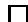

In the sequel, we shall need to record the cardinalities of various finite or countably infinite sets. To this end, we let  $\mathbb{N}^* = \mathbb{N} \cup \{\aleph_0\}$ , and we extend the ordering  $>$  and the arithmetic operations  $+$  and  $\cdot$  from  $\mathbb{N}$  to  $\mathbb{N}^*$  in the obvious way. Specifically, we define  $\aleph_0 > n$  for all  $n \in \mathbb{N}$ ; we define  $\aleph_0 + \aleph_0 = \aleph_0 \cdot \aleph_0 = \aleph_0$  and  $0 \cdot \aleph_0 = \aleph_0 \cdot 0 = 0$ ; we define  $n + \aleph_0 = \aleph_0 + n = \aleph_0$  for all  $n \in \mathbb{N}$ ; and we define  $n \cdot \aleph_0 = \aleph_0 \cdot n = \aleph_0$  for all  $n \in \mathbb{N}$  such that  $n > 0$ . Under this extension,  $>$  remains a total order, and  $+$ ,  $\cdot$  remain associative and commutative.

Our next task is to develop the means to talk about 'local configurations' in structures.

Definition 6. A star-type is a pair  $\sigma = \langle \pi, \bar{v} \rangle$ , where  $\pi$  is a 1-type, and  $\bar{v} = (v_1, \ldots, v_M)$  is an  $M$ -tuple over  $\mathbb{N}^*$  satisfying the condition that, for all  $j$  ( $1 \leq j \leq M$ ),

$$
v _ {j} > 0 \text {i m p l i e s} \operatorname {t p} _ {1} (\mu_ {j}) = \pi .
$$

In this context, we denote  $\pi$  by  $\mathrm{tp}(\sigma)$  and  $v_{j}$  by  $\sigma [j]$ . If  $\mathfrak{A}$  is a finite or countably infinite structure, and  $a\in A$ , we denote by  $\mathrm{st}^{\mathfrak{A}}[a]$  the star-type  $\langle \pi ,(v_1,\ldots ,v_M)\rangle$ , where  $\pi = \mathrm{tp}^{\mathfrak{A}}[a]$  and

$$
v _ {j} = | \{b \in A \backslash \{a \}: \operatorname {t p} ^ {\mathfrak {A}} [ a, b ] = \mu_ {j} \} |
$$

for all  $j$  ( $1 \leqslant j \leqslant M$ ). We call  $\operatorname{st}^{\mathfrak{A}}[a]$  the star-type of  $a$  in  $\mathfrak{A}$ ; and we say that a star-type  $\sigma$  is realized in  $\mathfrak{A}$  if  $\sigma = \operatorname{st}^{\mathfrak{A}}[a]$  for some  $a \in A$ .

We may think of  $\mathrm{st}^{\mathfrak{A}}[a]$  as a description of the 'local environment' of  $a$  in  $\mathfrak{A}$ : it records, in addition to the 1-type of  $a$  in  $\mathfrak{A}$ , the number of other elements to which  $a$  sends a message of type  $\mu_j$ , for each message-type  $\mu_j$ . Properties of star-types realized in models capture 'local' information about those models.

Definition 7. Let  $\sigma = \langle \pi, (v_1, \ldots, v_M) \rangle$  be a star-type. We say that  $\sigma$  is  $D$ -bounded, for  $D$  a positive integer, if  $\sigma[j] \leqslant D$  for all  $j$  ( $1 \leqslant j \leqslant M$ ). We say that  $\sigma$  is chromatic if, for every 1-type  $\pi'$ , the sum

$$
c = \sum \left\{v _ {j} \mid 1 \leqslant j \leqslant M ^ {*} \text {a n d} \operatorname {t p} _ {2} (\mu_ {j}) = \pi^ {\prime} \right\}
$$

satisfies  $c \leqslant 1$ , and satisfies  $c = 0$  if  $\pi' = \pi$ . We say that a finite or countably infinite structure  $\mathfrak{A}$  is  $D$ -bounded if every star-type realized in  $\mathfrak{A}$  is  $D$ -bounded.

Obviously, if  $\mathfrak{A} \models \varphi^{*}$ , then  $\mathfrak{A}$  is  $C$ -bounded. Importantly, information about the populations of star-types realized in models can tell us all that we need to know about those models, from the point of view of the fragment  $\mathcal{C}^2$ .

Definition 8. Let  $\mathfrak{A}$  be a finite or countably infinite structure, and let  $\bar{\sigma} = \sigma_1,\ldots ,\sigma_N$  be a list of star-types. For all  $k$  ( $1\leqslant k\leqslant N$ ), let  $w_{k}\in \mathbb{N}^{*}$  be given by

$$
w _ {k} = | \{a \in A \mid \operatorname {s t} ^ {\mathfrak {A}} [ a ] = \sigma_ {k} \} |.
$$

The  $\bar{\sigma}$ -histogram of  $\mathfrak{A}$ , denoted  $H_{\bar{\sigma}}(\mathfrak{A})$ , is the  $N$ -tuple  $(w_1, \ldots, w_N)$ .

We may thus think of  $H_{\bar{\sigma}}(\mathfrak{A})$  as a 'statistical profile' of  $\mathfrak{A}$ . For the next definitions, recall (Table 1) that  $\pi_1, \ldots, \pi_L$ , is an enumeration of the 1-types, and that  $\Xi$  is the set of silent 2-types.

Definition 9. If  $\mathfrak{A}$  is a structure and  $\pi, \pi'$  are 1-types (not necessarily distinct), we say that  $\pi$  and  $\pi'$  form a quiet pair in  $\mathfrak{A}$  if there exist distinct elements  $a$  and  $a'$  of  $A$ , such that  $\mathrm{tp}[a] = \pi$ ,  $\mathrm{tp}[a'] = \pi'$  and  $\mathrm{tp}[a, a']$  is silent.

Definition 10. Let  $\mathcal{I}$  be the set of unordered pairs of (not necessarily distinct) integers between 1 and  $L$ : that is,  $\mathcal{I} = \{\{i,i'\} \mid 1 \leqslant i \leqslant i' \leqslant L\}$ . A frame is a triple  $\mathcal{F} = (\bar{\sigma}, I, \theta)$ , satisfying:

1.  $\bar{\sigma} = (\sigma_{1},\dots,\sigma_{N})$  is an  $N$ -tuple of pairwise distinct star-types for some  $N > 0$ ;  
2.  $I\subseteq \mathcal{I}$  ; and  
3.  $\theta : I \to \Xi$  is a function such that, for all  $\{i, i'\} \in I$  with  $i \leqslant i'$ ,  $\mathrm{tp}_1(\theta(\{i, i'\})) = \pi_i$  and  $\mathrm{tp}_2(\theta(\{i, i'\})) = \pi_{i'}$ .

The frame  $\mathcal{F}$  is  $D$ -bounded if every star-type in  $\bar{\sigma}$  is  $D$ -bounded. Likewise,  $\mathcal{F}$  is chromatic if every star-type in  $\bar{\sigma}$  is chromatic.

Think of a frame  $\mathcal{F} = (\bar{\sigma}, I, \theta)$  as a (putative) schematic description of a structure, where  $\bar{\sigma}$  tells us which star-types are realized,  $I$  tells us which pairs of 1-types are quiet, and  $\theta$  selects, for each quiet pair of 1-types, a silent 2-type joining them. More precisely:

Definition 11. Let  $\mathfrak{A}$  be a structure and  $\mathcal{F} = (\bar{\sigma}, I, \theta)$  a frame. We say that  $\mathcal{F}$  describes  $\mathfrak{A}$  if the following conditions hold:

1.  $\bar{\sigma}$  is a list of all and only those star-types realized in  $\mathfrak{A}$ ;  
2. if  $\pi_i$  and  $\pi_{i'}$  form a quiet pair in  $\mathfrak{A}$ , then  $\{i, i'\} \in I$ ;  
3. if  $\pi_i$  and  $\pi_{i'}$  form a quiet pair in  $\mathfrak{A}$ , then there exist distinct  $a, a' \in A$  such that  $\mathrm{tp}^{\mathfrak{A}}[a, a'] = \theta(\{i, i'\})$ .

Frames contain the essential information required to determine whether certain structures they describe are models of  $\varphi^{*}$ . The next definition employs the notation established in Table 1 and Definition 6.

Definition 12. We write  $\mathcal{F} \models \varphi^{*}$  if the following conditions are satisfied:

1. for all  $k$  ( $1 \leqslant k \leqslant N$ ) and all  $j$  ( $1 \leqslant j \leqslant M$ ), if  $\sigma_k[j] > 0$  then  $\models \bigwedge \mu_j \rightarrow \alpha(x, y) \land \alpha(y, x)$ ;  
2. for all  $\{i,i^{\prime}\} \in I,\models \bigwedge \theta (\{i,i^{\prime}\})\to \alpha (x,y)\land \alpha (y,x);$  
3. for all  $k$  ( $1 \leqslant k \leqslant N$ ) and all  $h$  ( $1 \leqslant h \leqslant m$ ), the sum of all the  $\sigma_k[j]$  ( $1 \leqslant j \leqslant M$ ) such that  $f_h(x, y) \in \mu_j$  equals  $C_h$ .

The next lemma helps to motivate this definition.

Lemma 3. If  $\mathfrak{A} \models \varphi^*$ , then there exists a frame  $\mathcal{F}$  describing  $\mathfrak{A}$ , such that  $\mathcal{F} \models \varphi^*$ .

The proof is almost immediate: Conditions 1 and 2 in Definition 12 are secured by the fact that  $\mathfrak{A} \models \forall x \forall y (\alpha \lor x \approx y)$ , while Condition 3 is secured by the fact that  $\mathfrak{A} \models \bigwedge_{1 \leqslant h \leqslant m} \forall x \exists = C_h y (f_h(x, y) \land x \not\approx y)$ . The following Lemma also follows almost immediately from the above definitions.

Lemma 4. Let  $\mathfrak{A}$  be a structure,  $\mathcal{F}$  a frame describing  $\mathfrak{A}$ , and  $D$  a positive integer. Then:

1.  $\mathcal{F}$  is  $D$ -bounded if and only if  $\mathfrak{A}$  is  $D$ -bounded;  
2.  $\mathcal{F}$  is chromatic if and only if  $\mathfrak{A}$  is chromatic;

However, while every structure is described by some frame, not every frame describes a structure; and it is important for us to define a class of frames which do. To this end, we associate with a frame  $\mathcal{F}$  a collection of numerical parameters, as follows.

Notation 2. Let  $\mathcal{F} = (\bar{\sigma}, I, \theta)$  be a frame, where  $\bar{\sigma} = (\sigma_1, \dots, \sigma_N)$ , for some  $N > 0$ , and recall the notation established in Table 1 and Definition 6. If  $\mathcal{F}$  is clear from context, for integers  $i, k$  in the ranges  $1 \leqslant i \leqslant L$ ,  $1 \leqslant k \leqslant N$  write:

$$
\begin{array}{l} o _ {i k} = \left\{ \begin{array}{l} 1 \text {i f} \mathrm {t p} (\sigma_ {k}) = \pi_ {i} \\ 0 \text {o t h e r w i s e}; \end{array} \right. \\ p _ {i k} = \left\{ \begin{array}{l} 1 \text {i f , f o r a l l} j (1 \leqslant j \leqslant M), \operatorname {t p} _ {2} (\mu_ {j}) = \pi_ {i} \text {i m p l i e s} \sigma_ {k} [ j ] = 0 \\ 0 \text {o t h e r w i s e ;} \end{array} \right. \\ r _ {i k} = \sum_ {j \in J} \sigma_ {k} [ j ], \text {w h e r e} J = \{j \mid M ^ {*} + 1 \leqslant j \leqslant M \text {a n d} \operatorname {t p} _ {2} (\mu_ {j}) = \pi_ {i} \}; \\ s _ {i k} = \sum_ {j \in J} \sigma_ {k} [ j ], \text {w h e r e} J = \{j \mid 1 \leqslant j \leqslant M \text {a n d} \operatorname {t p} _ {2} (\mu_ {j}) = \pi_ {i} \}. \\ \end{array}
$$

In addition, for integers  $i,j$  in the ranges  $1 \leqslant i \leqslant L$ ,  $1 \leqslant j \leqslant M^{*}$ , write:

$$
q _ {j k} = \sigma_ {k} [ j ].
$$

With this notation in hand we can characterize a class of frames whose members are guaranteed to describe structures.

Definition 13. Let  $\mathcal{F} = (\bar{\sigma}, I, \theta)$  be a frame, where  $\bar{\sigma} = (\sigma_1, \dots, \sigma_N)$ . Let  $\bar{w} = (w_1, \dots, w_N)$  be an  $N$ -tuple over  $\mathbb{N}^*$ . Using Notation 2, for all  $i$  ( $1 \leqslant i \leqslant L$ ), all  $i'$  ( $1 \leqslant i' \leqslant L$ ) and all  $j$  ( $1 \leqslant j \leqslant M^*$ ), let:

$$
u _ {i} = \sum_ {1 \leqslant k \leqslant N} o _ {i k} w _ {k} \quad v _ {j} = \sum_ {1 \leqslant k \leqslant N} q _ {j k} w _ {k} \quad x _ {i i ^ {\prime}} = \sum_ {1 \leqslant k \leqslant N} o _ {i k} p _ {i ^ {\prime} k} w _ {k}.
$$

We say that an  $N$ -tuple  $\bar{w}$  over  $\mathbb{N}^*$  is a solution of  $\mathcal{F}$  if the following conditions are satisfied for all  $i$  ( $1 \leqslant i \leqslant L$ ), all  $i'$  ( $1 \leqslant i' \leqslant L$ ), all  $j$  ( $1 \leqslant j \leqslant M^*$ ) and all  $k$  ( $1 \leqslant k \leqslant N$ ):

(C1)  $v_{j} = v_{j^{\prime}}$ , where  $j^{\prime}$  is such that  $\mu_j^{-1} = \mu_{j'}$ ;  
(C2)  $s_{ik} \leqslant u_i$ ;

(C3)  $u_{i}\leqslant 1$  or  $u_{i} > Z$  
(C4) if  $o_{ik} = 1$ , then either  $u_i > 1$  or  $r_{i'k} \leqslant x_{i';i}$ ;  
(C5) if  $\{i,i^{\prime}\} \notin I$ , then either  $u_{i}\leqslant 1$  or  $u_{i^{\prime}}\leqslant 1$  
(C6) if  $\{i,i^{\prime}\} \notin I$  and  $o_{ik} = 1$ , then  $r_{i^{\prime}k}\geqslant x_{i^{\prime}i}$ .

The conditions C1-C6 in Definition 13 may be written as a quantifier-free formula in the language of Presburger arithmetic—in other words, as a Boolean combination of linear inequalities with integer coefficients and variables  $w_{1}, \ldots, w_{N}$ . By treating a negated inequality as a reversed inequality in the obvious way, we may assume that the Boolean combination in question is positive—i.e. involves only conjunction and disjunction. Denote this positive Boolean combination of inequalities by  $\mathcal{E}$ . By definition,  $\mathcal{F}$  has a solution if and only if  $\mathcal{E}$  is satisfied over  $\mathbb{N}^{*}$ ; and  $\mathcal{F}$  has a finite solution (i.e. a solution in which all values are finite) if and only if  $\mathcal{E}$  is satisfied over  $\mathbb{N}$ .

We are at last in a position to state the key lemmas of this section.

Lemma 5. If  $\mathfrak{A}$  is a differentiated structure and  $\mathcal{F} = \langle \bar{\sigma}, I, \theta \rangle$  is a frame describing  $\mathfrak{A}$ , then  $H_{\bar{\sigma}}(\mathfrak{A})$  is a solution of  $\mathcal{F}$ .

Proof. Pratt-Hartmann [11], Lemma 13, Lemma 16.

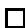

Lemma 6. If  $\mathcal{F}$  is a chromatic frame such that  $\mathcal{F} \models \varphi^{*}$ , and  $\bar{w}$  is a solution of  $\mathcal{F}$ , then there exists a structure  $\mathfrak{A}$  such that: (i)  $\mathfrak{A} \models \varphi^{*}$ ; (ii)  $\mathcal{F}$  describes  $\mathfrak{A}$ ; and (iii)  $\bar{w} = H_{\bar{\sigma}}(\mathfrak{A})$ .

Proof. Pratt-Hartmann [11], Lemma 14, Lemma 17.

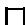

Lemmas 5 and 6 in effect state that, to determine the satisfiability of  $\varphi^{*}$ , it suffices to guess a  $C$ -bounded, differentiated, chromatic frame  $\mathcal{F}$ , and to test that  $\mathcal{F}$  has a solution and that  $\mathcal{F} \models \varphi^{*}$ . Furthermore, by testing instead whether  $\mathcal{F}$  has a finite solution, we can determine the finite satisfiability of  $\varphi^{*}$ . The proof of Lemma 5 is relatively straightforward; that of Lemma 6 is more challenging, because it involves constructing a model  $\mathfrak{A}$  of  $\varphi^{*}$ , given only the frame  $\mathcal{F}$  and its solution. It can in fact be shown that we may without loss of generality confine attention to frames whose size (measured in the obvious way) is bounded by a singly exponential function of the size of  $\varphi^{*}$  (Pratt-Hartmann [11], Lemma 10). From this it follows that the problems of determining the satisfiability/finite satisfiability of a given  $\mathcal{C}^2$ -formula are in NEXPTIME. In the present context of investigating the data-complexity of  $\mathcal{C}^2$ , however, this matter may be safely ignored.

# 4 Data-complexity of satisfiability and finite satisfiability for  $\mathcal{C}^2$

In this section, we give bounds on the data-complexity of satisfiability and finite satisfiability in  $\mathcal{C}^2$ .

We consider the upper bounds first. For any  $\mathcal{C}^2$ -formula  $\varphi$ , we describe a pair of non-deterministic polynomial-time procedures to determine the satisfiability and finite satisfiability of  $\Delta \cup \{\varphi\}$ , where  $\Delta$  is a given set of ground, non-functional literals. The strategy is as follows. Relying on Lemmas 5 and 6, we guess a frame  $\mathcal{F}$  such that  $\mathcal{F} \models \varphi$ , and assemble the inequalities required for  $\mathcal{F}$  to have a solution. By augmenting these inequalities with extra conditions (based on  $\Delta$ ), we can check for the existence of a (finite) model of  $\varphi$  whose histogram (with respect to some sequence of star-types) is such that a model of  $\Delta$  can be spliced into it, thus yielding a model of  $\Delta \cup \{\varphi\}$ .

If  $\Delta$  is a set of ground, function-free literals, we denote by  $\mathrm{const}(\Delta)$  the set of individual constants occurring in  $\Delta$ .

Theorem 1. For any  $\mathcal{C}^2$ -sentence  $\varphi$ , both  $\mathcal{S}_{\varphi}$  and  $\mathcal{FS}_{\varphi}$  are in NP.

Proof. Let  $\varphi$  be a  $\mathcal{C}^2$ -formula, and  $\Delta$  a set of ground, function-free literals, over a signature  $\Sigma_{\Delta}$ . Let  $\varphi^{*}$  and  $C$  be as in Lemma 1. Determining whether  $\Delta \cup \{\varphi\}$  has a model of size  $C$  or less is straightforward. For we may list, in constant time, all models of  $\varphi$  of size  $C$  or less (interpreting the signature of  $\varphi$ ). Fixing any such model  $\mathfrak{A}$ , we may then guess an expansion  $\mathfrak{A}^{+}$  of  $\mathfrak{A}$  interpreting  $\Sigma_{\Delta}$ , and check that  $\mathfrak{A}^{+} \models \Delta$ . This (non-deterministic) process can be executed in time bounded by a linear function of  $\|\Delta\|$ . Hence, it suffices to determine whether  $\Delta \cup \{\varphi^{*}\}$  has a model.

From now on, we fix the formula  $\varphi^{*}$  having the form (2), and employ the notation of Table 1, together with the associated notions of 1-type, message-type and star-type over the signature  $\Sigma^{*}$ . Since  $\Sigma^{*}$  contains  $2\lceil \log Z\rceil +1$  unary predicates not occurring in  $\varphi$ , pick one of these extra predicates,  $o$ . We call a 1-type  $\pi$  observable if  $o(x)\in \pi$ , we call a message-type  $\rho$  observable if  $\mathrm{tp}_1(\rho)$  and  $\mathrm{tp}_2(\rho)$  are observable, and we call a star-type  $\sigma$  observable if  $\mathrm{tp}(\sigma)$  is observable. Informally (and somewhat approximately), we read  $o(x)$  as " $x$  is an element which interprets a constant in  $\Delta$ ".

We now define two non-deterministic procedures operating on  $\varphi^{*}$  and  $\Delta$ . We show that both procedures run in time bounded by a polynomial function of  $\| \Delta \|$ , that the first of these procedures has a successful run if and only if  $\Delta \cup \{\varphi^{*}\}$  is satisfiable, and that the second has a successful run if and only if  $\Delta \cup \{\varphi^{*}\}$  is finitely satisfiable. This proves the theorem. Procedure I is as follows.

1. Guess a structure  $\mathfrak{D}^+$  interpreting the signature  $\Sigma^{*}\cup \Sigma_{\Delta}$  over a domain  $D$  with  $|D|\leqslant \mathrm{const}(\Delta)$ ; and let  $\mathfrak{D}$  be the reduct of  $\mathfrak{D}^+$  to the signature  $\Sigma^{*}$ . If  $\mathfrak{D}^+ \nmid \Delta$  or  $\mathfrak{D} \nmid \forall x\forall y (\alpha \lor x \approx y)$ , then fail.  
2. Guess a list  $\sigma_{1},\ldots ,\sigma_{N^{\prime}}$  of observable,  $C$  -bounded, chromatic star-types,

and guess a further list  $\sigma_{N' + 1},\ldots ,\sigma_N$  of non-observable,  $C$  -bounded, chromatic star-types. Write

$$
\bar {\sigma} = \sigma_ {1}, \dots , \sigma_ {N ^ {\prime}}, \sigma_ {N ^ {\prime} + 1}, \dots , \sigma_ {N},
$$

and guess a frame  $\mathcal{F} = \langle \bar{\sigma}, I, \theta \rangle$  with these star-types. If  $\mathcal{F} \not\models \varphi^*$ , then fail.

3. Guess a function  $\delta : D \to \{\sigma_1, \ldots, \sigma_{N'}\}$  mapping every element of  $D$  to one of the observable star-types of  $\mathcal{F}$ . Writing  $\langle \pi^d, (v_1^d, \ldots, v_M^d) \rangle$  for  $\delta(d)$ , if, for any  $d \in D$ , either of the conditions

(a)  $\pi^d = \mathrm{tp}^\mathfrak{D}[d]$  
(b) for all  $j$  ( $1 \leqslant j \leqslant M$ ) such that  $\rho_j$  is an observable message-type,

$$
v _ {j} ^ {d} = | \{d ^ {\prime} \in D \mid d ^ {\prime} \neq d \mathrm {a n d} \mathrm {t p} ^ {\mathfrak {D}} [ d, d ^ {\prime} ] = \mu_ {j} \} |
$$

does not hold, then fail. Otherwise, record the numbers  $n_1, \ldots, n_{N'}$  where, for all  $k$  ( $1 \leqslant k \leqslant N'$ ),  $n_k = |\delta^{-1}(\sigma_k)|$ , and then forget  $\delta$ .

4. Let  $\mathcal{E}$  be the (positive) Boolean combination of inequalities required for  $\mathcal{F}$  to have a solution, as explained in Section 3. Guess the truth-values of all the inequalities involved in  $\mathcal{E}$ . If the guess makes  $\mathcal{E}$  false (considered as a Boolean combination), fail; otherwise, let  $\mathcal{E}'$  be the set of these inequalities guessed to be true.

5. Recalling the numbers  $n_k$  from Step 3 let

$$
\mathcal {E} _ {\delta} ^ {\prime} = \mathcal {E} ^ {\prime} \cup \left\{w _ {k} = n _ {k} \mid 1 \leqslant k \leqslant N ^ {\prime} \right\}.
$$

If there is no solution of  $\mathcal{E}_{\delta}^{\prime}$ , then fail.

# 6. Succeed.

Procedure II is exactly the same as Procedure I, except in Step 5. Instead of failing if there is no solution of  $\mathcal{E}_{\delta}^{\prime}$ , we instead fail if there is no finite solution of  $\mathcal{E}_{\delta}^{\prime}$ .

We consider the running time of Procedure I, writing  $\| \Delta \| = n$ . Step 1 can be executed in time  $O(n^{3})$ . Step 2 can be executed in constant time. In executing Step 3, we note that, once  $\delta (d)$  has been guessed and checked, the space required to do so can be recovered; only the tallies  $n_1,\ldots ,n_{N'}$  need be kept, and this never requires more than  $N^{\prime}\log n$  space. Moreover, in checking  $\delta (d)$ , the only difficulty is to compute the quantities  $|\{d'\in D\mid d'\neq d$  and  $\mathrm{tp}^{\mathfrak{D}}[d,d'] = \mu_j\}$  for observable message types  $\mu_{j}$ ; but this never requires more than  $\log n$  space. Hence Step 3, can be executed in space  $O(\log (n))$ , and hence in time bounded by a polynomial function of  $n$ . Step 4 can be executed in constant time. Step 5 involves determining the existence of a solution to the inequalities in  $\mathcal{E}_{\delta}'$ . Since the size of  $\mathcal{E}'$  is bounded by a constant, the size of  $\mathcal{E}_{\delta}'$  is in fact  $O(\log n)$ ; moreover,  $\mathcal{E}_{\delta}'$  involves a fixed number of variables. After guessing which of these

variables take infinite values, this problem can be solved using Lenstra's algorithm (Lenstra [8]) in time bounded by some fixed polynomial function of  $\log n$ , and hence certainly in time  $O(n)$ . Thus, Procedure I can be executed in polynomial time. Procedure II can also be executed in polynomial time, by an almost identical argument.

We show that Procedure I has a successful run if and only if  $\Delta \cup \{\varphi^{*}\}$  is satisfiable, and that Procedure II has a successful run if and only if  $\Delta \cup \{\varphi^{*}\}$  is finitely satisfiable. Suppose  $\mathfrak{A}^+$  is a finite or countably infinite model of  $\Delta \cup \{\varphi^{*}\}$ , interpreting the signature  $\Sigma^{*} \cup \Sigma_{\Delta}$  over a domain  $A$ ; let  $\mathfrak{A}$  be the reduct of  $\mathfrak{A}^+$  to  $\Sigma^{*}$ ; and let  $D \subseteq A$  be the set of all and only those elements interpreting the constants  $\mathrm{const}(\Delta)$  in  $\mathfrak{A}^+$ . By assumption,  $\Sigma^{*}$  contains  $2[\log Z] + 1$  unary predicates not occurring in  $\varphi^{*}$ , one of which is the predicate  $o$ . By reinterpreting these new predicates if necessary, we may assume that  $o^{\mathfrak{A}} = D$ , and furthermore (by Lemma 2) that  $\mathfrak{A}$  is differentiated and chromatic. Let  $\mathfrak{D}^+$  be the restriction of  $\mathfrak{A}^+$  to  $D$ , and  $\mathfrak{D}$  the restriction of  $\mathfrak{A}$  to  $D$  (so that  $\mathfrak{D}$  is a reduct of  $\mathfrak{D}^+$ ). With these choices, Step 1 succeeds. By Lemma 3, let  $\mathcal{F}$  be a frame describing  $\mathfrak{A}$  such that  $\mathcal{F} \models \varphi^{*}$ . By Lemma 4, Parts 1 and 2,  $\mathcal{F}$  is  $C$ -bounded and chromatic. Without loss of generality, we may assume the star-types in  $\mathcal{F}$  to be  $\bar{\sigma} = \sigma_1, \dots, \sigma_{N'}, \sigma_{N' + 1}, \dots, \sigma_N$ , where  $\sigma_1, \dots, \sigma_{N'}$  are the star-types realized in  $\mathfrak{A}$  by elements of  $D$ , and  $\sigma_{N' + 1}, \dots, \sigma_N$  are the star-types realized in  $\mathfrak{A}$  by elements of  $A \setminus D$ . With these choices, Step 2 succeeds. Define  $\delta: D \to \{\sigma_1, \dots, \sigma_{N'}\}$  by setting  $\delta(d) = \operatorname{st}^{\mathfrak{A}}[d]$ . With these choices, Step 3 succeeds. Let  $\bar{w} = H_{\bar{\sigma}}(\mathfrak{A})$ , so that, by Lemma 5,  $\bar{w}$  is a solution of  $\mathcal{E}$ . Let  $\mathcal{E}'$  be the set of inequalities mentioned in  $\mathcal{E}$  which are satisfied by  $\bar{w}$ . With these choices, Step 4 succeeds. The above choice of  $\bar{w}$  ensures that  $\bar{w}$  satisfies  $\mathcal{E}'$ ; to show that Step 5—and hence the whole procedure—succeeds, it suffices to show that, for all  $k$  ( $1 \leqslant k \leqslant N'$ )  $w_k = n_k$ . Now, since  $o^{\mathfrak{A}} = D$ ,  $a \in A$  has an observable star-type  $\sigma_k$  if and only if  $a \in D$ . But for  $d \in D$ , we have  $\delta(d) = \operatorname{st}^{\mathfrak{A}}[d]$ , whence  $n_k' = |\delta^{-1}(\sigma_k)|$  is the number of elements  $d \in D$  such that  $\operatorname{st}^{\mathfrak{A}}[d] = \sigma_k$ , and hence the number of elements  $a \in A$  such that  $\operatorname{st}^{\mathfrak{A}}[a] = \sigma_k$ . That is:  $w_k = n_k$  as required. The corresponding argument for Procedure II is almost identical, noting that, if  $\mathfrak{A}^+$  is finite, then  $\bar{w} = H_{\bar{\sigma}}(\mathfrak{A})$  will consist entirely of finite values.

Suppose, conversely, that Procedure I has a successful run. Let  $\mathfrak{D}^+$ ,  $\mathfrak{D}$ ,  $\delta$ ,  $\mathcal{F}$ , and  $\mathcal{E}'$  be as guessed in this run, and let  $\bar{w} = w_1, \ldots, w_N$  be a solution of  $\mathcal{E}_{\delta}'$ , guaranteed by the fact that Step 5 succeeds. Since Step 1 succeeds, we have  $\mathfrak{D}^+ \models \Delta$ , and  $\mathfrak{D} \models \forall x \forall y (\alpha \lor x \approx y)$ . By assumption,  $\mathcal{F}$  is chromatic; moreover, since Step 2 succeeds,  $\mathcal{F} \models \varphi^*$ . Since Step 4 succeeds,  $\bar{w}$  is a solution of the Boolean combination of inequalities  $\mathcal{E}$ , and hence a solution of the frame  $\mathcal{F}$ . By Lemma 6, then, let  $\mathfrak{A}$  be a model of  $\varphi^*$  described by  $\mathcal{F}$  in which the star-types  $\sigma_1, \ldots, \sigma_N$  are realized  $w_1, \ldots, w_N$  times, respectively.

We proceed to define a structure  $\mathfrak{A}'$  such that  $\mathfrak{A}' \models \Delta \cup \{\varphi^*\}$ . Let  $D' = o^{\mathfrak{A}}$ , and, for all  $k$  ( $1 \leqslant k \leqslant N'$ ), let  $D_k' = \{a \in A \mid \operatorname{st}^{\mathfrak{A}}[a] = \sigma_k\}$ . Evidently, the sets  $D_1', \ldots, D_{N'}'$  partition  $D'$ . On the other hand, consider the domain  $D$  of the structure  $\mathfrak{D}$ , and, for all  $k$  ( $1 \leqslant k \leqslant N'$ ), let  $D_k = \delta^{-1}(\sigma_k)$ . These sets

are pairwise disjoint, and from the fact that  $\bar{w}$  is a solution of  $\mathcal{E}_{\delta}^{\prime}$ , we have  $|D_k| = |D_k^{\prime}|$ , for all  $k$  ( $1 \leqslant k \leqslant N^{\prime}$ ). By replacing  $\mathfrak{A}$  with a suitable isomorphic copy if necessary, we can assume that  $D_{k} = D_{k}^{\prime}$  for all  $k$  ( $1 \leqslant k \leqslant N^{\prime}$ ). We thus have: (i)  $D = D^{\prime} \subseteq A$ ; (ii)  $\operatorname{st}^{\mathfrak{A}}[d] = \delta(d)$  for all  $d \in D$ ; and (iii)  $o^{\mathfrak{A}} = D$ . Now define the structure  $\mathfrak{A}'$  interpreting  $\Sigma^{*}$  over the domain  $A$  by setting:

$$
\operatorname {t p} ^ {\mathfrak {A} ^ {\prime}} [ a, b ] = \left\{ \begin{array}{l} \operatorname {t p} ^ {\mathfrak {D}} [ a, b ] \text {i f} a \in D \text {a n d} b \in D \\ \operatorname {t p} ^ {\mathfrak {A}} [ a, b ] \text {o t h e r w i s e}. \end{array} \right.
$$

To ensure that no clashes can occur in these assignments, we must show that  $\mathrm{tp}^{\mathfrak{A}}[a] = \mathrm{tp}^{\mathfrak{D}}[a]$  for all  $a \in D$ . But this follows from the success of Step 3 (specifically, from Condition 3a) and the already-established fact that  $\mathrm{st}^{\mathfrak{A}}[a] = \delta(a)$ . By construction, then,  $\mathfrak{D} \subseteq \mathfrak{A}'$ . Indeed, taking  $\mathfrak{A}^{+}$  to be the expansion of  $\mathfrak{A}'$  obtained by interpreting the symbols of  $\Sigma_{\Delta} \setminus \Sigma^{*}$  in the same way as  $\mathfrak{D}^{+}$ , we immediately have  $\mathfrak{A}^{+} \models \Delta$ . To show that  $\Delta \cup \{\varphi^{*}\}$  is satisfiable, therefore, we require only to show that  $\mathfrak{A}' \models \varphi^{*}$ . Note first of all that the only 2-types realized in  $\mathfrak{A}'$  are 2-types realized either in  $\mathfrak{A}$  or in  $\mathfrak{D}$ . But  $\mathfrak{A} \models \varphi^{*}$ , and  $\mathfrak{D} \models \forall x \forall y (\alpha \lor x \approx y)$ , whence  $\mathfrak{A}' \models \forall x \forall y (\alpha \lor x \approx y)$ . Therefore, it suffices to show that, for all  $a \in A$ ,  $\mathrm{st}^{\mathfrak{A}'}[a] = \mathrm{st}^{\mathfrak{A}}[a]$ , from which it follows that  $\mathfrak{A}' \models \bigwedge_{1 \leqslant h \leqslant m} \forall x \exists_{= C_h} y (f_h(x, y) \land x \not\approx y)$ . If  $a \notin D$ , then  $\mathrm{st}^{\mathfrak{A}'}[a] = \mathrm{st}^{\mathfrak{A}}[a]$  is immediate from the construction of  $\mathfrak{A}'$ ; so suppose  $a = d \in D$ . Let us write

$$
\operatorname {s t} ^ {\mathfrak {A}} [ d ] = \delta (d) = \langle \pi , (v _ {1} ^ {d}, \dots , v _ {M} ^ {d}) \rangle
$$

$$
\operatorname {s t} ^ {\mathfrak {A} ^ {\prime}} [ d ] = \langle \pi , (v _ {1} ^ {\prime}, \dots , v _ {M} ^ {\prime}) \rangle .
$$

Fix  $k$  ( $1 \leqslant j \leqslant M$ ), and suppose first that  $\rho_{j}$  is not observable. Since  $D \subseteq o^{\mathfrak{A}}$ , we have, by the construction of  $\mathfrak{A}'$ ,  $\mathrm{tp}^{\mathfrak{A}'}[d,b] = \mu_j$  if and only if  $b \notin D$  and  $\mathrm{tp}^{\mathfrak{A}}[d,b] = \mu_j$ ; it is then immediate that  $v_{j}' = v_{j}^{d}$ . Suppose, on the other hand, that  $\rho_{j}$  is observable. Since  $o^{\mathfrak{A}} \subseteq D$ , we have, by the construction of  $\mathfrak{A}'$ ,  $\mathrm{tp}^{\mathfrak{A}'}[d,b] = \mu_j$  if and only if  $b \in D$  and  $\mathrm{tp}^{\mathfrak{D}}[d,b] = \mu_j$ ; but then the success of Step 3 (specifically, Condition 3b) then guarantees that  $v_{j}' = v_{j}^{d}$ . Hence, for all  $a \in A$ ,  $\mathrm{st}^{\mathfrak{A}'}[a] = \mathrm{st}^{\mathfrak{A}}[a]$ , as required. The corresponding argument for Procedure II is almost identical: we need only observe that, by requiring the numbers  $w_{N' + 1}, \ldots, w_{N}$  to be in  $\mathbb{N}$ , the constructed model  $\mathfrak{A}^{+}$  will be finite.

The matching lower bound to Theorem 1 is almost trivial. In fact, much smaller fragments than  $\mathcal{C}^2$  suffice for this purpose: recall that  $\mathcal{G}^{2-}$  is the fragment of  $\mathcal{G}\mathcal{C}^2$  in which no counting quantifiers and no instances of  $\approx$  occur.

Theorem 2. There exists a  $\mathcal{G}^{2^{-}}$ -sentence  $\varphi$  for which the problems  $S_{\varphi}$  and  $\mathcal{FS}_{\varphi}$  coincide, and are NP-hard.

Proof. By reduction of 3SAT. Let  $c$  and  $t$  be unary predicates and  $l_{1}, l_{2}, l_{3}, o$  and  $s$  binary predicates. (Read  $c(x)$  as " $x$  is a clause",  $l_{i}(x, y)$  as " $y$  is the  $i$ th literal of  $x$ ",  $t(x)$  as " $x$  is a true literal",  $o(x, y)$  as " $x$  and  $y$  are mutually

opposite literals", and  $s(x, y)$  as " $x$  and  $y$  are the same literal".) Let  $\varphi$  be

$$
\forall x (c (x) \rightarrow \bigvee_ {1 \leqslant j \leqslant 3} \exists y (l _ {j} (x, y) \wedge t (y))) \wedge
$$

$$
\begin{array}{l} \forall x \forall y (o (x, y) \rightarrow (t (x) \leftrightarrow \neg t (y))) \wedge \forall x \forall y (s (x, y) \rightarrow (t (x) \leftrightarrow t (y))) \wedge \\ \bigwedge_ {1 \leqslant j \leqslant 3} \forall x (\exists y (l _ {j} (x, y) \wedge t (y)) \rightarrow \forall y (l _ {j} (x, y) \rightarrow t (y))). \\ \end{array}
$$

We reduce 3SAT to the problems  $S_{\varphi}$  and  $\mathcal{FS}_{\varphi}$ , which we simultaneously show to be identical. Suppose a finite set  $\Gamma = \{C_1, \ldots, C_n\}$  of 3-literal clauses is given, where  $C_i = L_{i,1} \lor L_{i,2} \lor L_{i,3}$ . Let  $a_i$  ( $1 \leqslant i \leqslant n$ ) and  $b_{i,j}$  ( $1 \leqslant i \leqslant n$ ;  $1 \leqslant j \leqslant 3$ ) be pairwise distinct individual constants, and let  $\Delta_{\Gamma}$  be the following set of ground, function-free literals:

$$
\begin{array}{l} \{c \left(a _ {i}\right) \mid 1 \leqslant i \leqslant n \} \cup \left\{l _ {j} \left(a _ {i}, b _ {i, j}\right) \mid 1 \leqslant i \leqslant n \text {a n d} 1 \leqslant j \leqslant 3 \right\} \cup \\ \{o \left(b _ {i, j}, b _ {i ^ {\prime}, j ^ {\prime}}\right) \mid L _ {i, j} \text {a n d} L _ {i ^ {\prime}, j ^ {\prime}} \text {a r e o p p o s i t e l i t e r a l s} \} \cup \\ \{s \left(b _ {i, j}, b _ {i ^ {\prime}, j ^ {\prime}}\right) \mid L _ {i, j} \text {a n d} L _ {i ^ {\prime}, j ^ {\prime}} \text {a r e t h e s a m e l i t e r a l} \}. \\ \end{array}
$$

It is routine to check that: (i) if  $\{\varphi\} \cup \Delta_{\Gamma}$  is satisfiable, then  $\Gamma$  is satisfiable; (ii) if  $\Gamma$  is satisfiable, then  $\{\varphi\} \cup \Delta_{\Gamma}$  is finitely satisfiable.

Since, as we remarked above, the (finite) query-answering problem is at least as hard as the (finite) unsatisfiability problem, Theorem 2 also provides a lower bound for the complexity of (finite) query answering in  $\mathcal{GC}^2$  (matching Theorem 4 below). Specifically, let  $\varphi \in \mathcal{GC}^2$  be the sentence constructed in the proof of Theorem 2, and  $p$  a unary predicate; then the problems  $\mathcal{Q}_{\varphi,\exists xp(x)}$  and  $\mathcal{F}\mathcal{Q}_{\varphi,\exists xp(x)}$  coincide, and are co-NP-complete. We remark that lower complexity bounds of co-NP for query-answering problems are not always obtained in this way (i.e. by reduction to the corresponding unsatisfiability problem), especially in inexpressive fragments. A good example is provided by the fragments considered in Calvanese et al. [3] (Theorem 8), who use instead a closely related result on 'instance checking' in description logics (Schaerf [14], Theorem 3.2). For similar results concerning an expressive logic, see Hustadt et al. [6], Theorems 20 and 26.

We conclude this section by showing that there is no hope of extending Theorem 1 to a result concerning query answering: query-answering and finite query answering problems with respect to  $\mathcal{C}^2$ -formulas are in general undecidable. (Again, much smaller fragments than  $\mathcal{C}^2$  suffice for this purpose.) We employ the standard apparatus of tiling systems. In this context, recall that a tiling system is a triple  $T = \langle C,H,V\rangle$ , where  $C$  is a non-empty, finite set of tiles and  $H$ ,  $V$  are binary relations on  $C$ . For  $N\in \mathbb{N}$ , let  $\mathbb{N}_N$  denote the set  $\{0,1,\ldots ,N - 1\}$ . An infinite tiling for  $T$  is a function  $f:\mathbb{N}^2\to C$  such that, for all  $i,j\in \mathbb{N}$ ,  $\langle f(i,j),f(i + 1,j)\rangle \in H$  and  $\langle f(i,j),f(i,j + 1)\rangle \in V$ . An  $N$ -tiling for  $T$  is a function  $f:\mathbb{N}_N^2\to C$  such that, for all  $i,j\in \mathbb{N}_N$ ,  $\langle f(i,j),f(i + 1,j)\rangle \in H$  and  $\langle f(i,j),f(i,j + 1)\rangle \in V$  (addition modulo  $N$ ). The infinite tiling problem on  $T$  is the following problem: given a sequence  $c_{0},\dots ,c_{n}$  of elements of

$C$  (repeats allowed), determine whether there exists an infinite tiling  $f$  for  $T$  such that  $f(i,0) = c_{i}$  for all  $i$ $(0\leqslant i\leqslant n)$ . The finite tiling problem on  $T$  is the following problem: given a sequence  $c_{0},\ldots ,c_{n}$  of elements of  $C$  (repeats allowed), determine whether there exist an  $N > n$  and an  $N$ -tiling  $f$  for  $T$  such that  $f(i,0) = c_{i}$  for all  $i$ $(0\leqslant i\leqslant n)$ . It is well-known that there exist tiling systems for which the infinite tiling problem is co-r.e.-complete, and that there exist tiling systems for which the finite tiling problem is r.e.-complete.

Lemma 7. Let  $h$  and  $v$  be binary predicates, and let  $\gamma$  be the formula

$$
\forall x _ {1} \forall x _ {2} \forall x _ {3} \forall x _ {4} (h (x _ {1}, x _ {2}) \land v (x _ {1}, x _ {3}) \land v (x _ {2}, x _ {4}) \rightarrow h (x _ {3}, x _ {4})).
$$

There exists a sentence  $\varphi$  in  $\mathcal{G}^{2-}$  such that the problem  $S_{\varphi \wedge \gamma}$  is co-r.e.-complete. There exists a sentence  $\varphi$  in  $\mathcal{G}^{2-}$  such that the problem  $\mathcal{FS}_{\varphi \wedge \gamma}$  is r.e.-complete.

Proof. Let  $T = \langle C, H, V \rangle$  be a tiling system whose infinite tiling problem is co-r.e.-complete. Treating the tiles  $c \in C$  as unary predicates, let  $\varphi_0$  be the formula

$$
\forall x \exists y h (x, y) \land \forall x \exists y v (x, y),
$$

let  $\varphi_T$  be the formula

$$
\begin{array}{l} \forall x \left(\bigvee_ {c \in C} c (x)\right) \land \bigwedge_ {c \neq c ^ {\prime}} \forall x (c (x) \to \neg c ^ {\prime} (x)) \land \\ \bigwedge_ {\langle c, c ^ {\prime} \rangle \notin H} \forall x \forall y (h (x, y) \rightarrow \neg (c (x) \land c (y))) \land \\ \bigwedge_ {\langle c, c ^ {\prime} \rangle \not \in V} \forall x \forall y (v (x, y) \rightarrow \neg (c (x) \land c (y))), \\ \end{array}
$$

and let  $\varphi$  be  $\varphi_0\wedge \varphi_T$ . Now, given a sequence  $\bar{c} = c_{0},\ldots ,c_{n}$  of elements of  $C$  (repeats allowed), let  $a_0,\dots ,a_n$  be individual constants, and let  $\Delta_{\bar{c}}$  be the set of ground, function-free literals

$$
\left\{c _ {0} (a _ {0}), h (a _ {0}, a _ {1}), c _ {1} (a _ {1}), h (a _ {1}, a _ {2}), \dots , c _ {n - 1} (a _ {n - 1}), h (a _ {n - 1}, a _ {n}), c _ {n} (a _ {n}) \right\}.
$$

We claim that the instance  $\bar{c}$  of the infinite tiling problem for  $T$  is positive if and only if  $\Delta \cup \{\varphi \wedge \gamma\}$  is satisfiable. Thus, the problem  $\mathcal{S}_{\varphi \wedge \gamma}$  is co-r.e.-complete, proving the first statement of the lemma.

To prove the claim, if  $f$  is an infinite tiling for  $T$  with  $f(i,0) = c_{i}$  for all  $i$  ( $0 \leqslant i \leqslant n$ ), construct the model  $\mathfrak{A}$  as follows. Let  $A = \mathbb{N}^2$ ; let  $a_{i}^{\mathfrak{A}} = (i,0)$  for all  $i$  ( $0 \leqslant i \leqslant n$ ); let  $h^{\mathfrak{A}} = \{\langle (i,j),(i + 1,j)\rangle \mid i,j\in \mathbb{N}\}$ ; let  $v^{\mathfrak{A}} = \{\langle (i,j),(i,j + 1)\rangle \mid i,j\in \mathbb{N}\}$ ; and let  $c^{\mathfrak{A}} = \{(i,j) \mid f(i,j) = c\}$  for all  $c\in C$ . It is routine to check that  $\mathfrak{A} \models \{\varphi \wedge \gamma\} \cup \Delta_{\bar{c}}$ . Conversely, suppose  $\mathfrak{A} \models \{\varphi \wedge \gamma\} \cup \Delta_{\bar{c}}$ . Define a function  $g:\mathbb{N}^2\to A$  as follows. First, set  $g(i,0) = a_{i}^{\mathfrak{A}}$  for all  $i$  ( $0\leqslant i\leqslant n$ ). Now, if  $i$  is the largest integer such that  $g(i,0)$  has been defined, select any  $b\in A$  such that  $\langle g(i,0),b\rangle \in h^{\mathfrak{A}}$  (possible, since  $\mathfrak{A} \models \varphi_0$ ), and set  $g(i + 1,0) = b$ . This

defines  $g(i,0)$  for all  $i \in \mathbb{N}$ . Fixing any  $i$ , if  $j$  is the largest integer such that  $g(i,j)$  has been defined, select any  $b \in A$  such that  $\langle g(i,j),b\rangle \in v^{\mathfrak{A}}$  (possible, since  $\mathfrak{A} \models \varphi_0$ ), and set  $g(i,j + 1) = b$ . This defines  $g(i,j)$  for all  $i,j \in \mathbb{N}$ . Since  $\mathfrak{A} \models \Delta_{\bar{c}} \cup \{\gamma\}$ , we have, for all  $i,j \in \mathbb{N}$ ,  $\langle (i,j),(i + 1,j)\rangle \in h^{\mathfrak{A}}$  and  $\langle (i,j),(i,j + 1)\rangle \in v^{\mathfrak{A}}$ . We now define an infinite tiling  $f: \mathbb{N}^2 \to C$  as follows. Since  $\mathfrak{A} \models \varphi_T$ , we set  $f(i,j)$  to be the unique  $c \in C$  such that  $\mathfrak{A} \models c[g(i,j)]$ . Finally, since  $\mathfrak{A} \models \Delta_{\bar{c}}$ , we have  $f(i,0) = c_i$  for all  $i$  ( $1 \leqslant i \leqslant n$ ).

The second statement of the lemma is proved analogously.

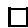

Recall that we denote by  $\mathcal{L}^{2-}$  the fragment of  $\mathcal{C}^2$  in which no counting quantifiers and no instances of  $\approx$  occur.

Theorem 3. There exist an  $\mathcal{L}^{2-}$ -sentence  $\varphi'$  and a positive conjunctive query  $\psi(\bar{y})$  such that  $\mathcal{Q}_{\varphi', \psi(\bar{y})}$  is undecidable. Similarly for  $\mathcal{F}\mathcal{Q}_{\varphi', \psi(\bar{y})}$ .

Proof. We deal with  $\mathcal{Q}_{\varphi', \psi(\bar{y})}$  only; the proof for  $\mathcal{F}\mathcal{Q}_{\varphi', \psi(\bar{y})}$  is analogous. Let the binary predicate  $h$  and the formulas  $\gamma$  and  $\varphi$  be as in (the first statement of) Lemma 7. Let  $p$  be a new unary predicate and  $\bar{h}$  a new binary predicate. Now let  $\varphi'$  be the formula

$$
\varphi \wedge \forall x y (\bar {h} (x, y) \leftrightarrow \neg h (x, y)),
$$

and  $\psi$  the positive conjunctive query

$$
\exists x _ {1} \exists x _ {2} \exists x _ {3} \exists x _ {4} \exists x (h (x _ {1}, x _ {2}) \wedge v (x _ {1}, x _ {3}) \wedge v (x _ {2}, x _ {4}) \wedge \bar {h} (x _ {3}, x _ {4}) \wedge p (x)).
$$

It is obvious that, if  $\Delta$  is any set of ground, non-functional literals (not involving the predicates  $p$  or  $\bar{h}$ ), then

$$
\begin{array}{l} \Delta \cup \{\varphi^ {\prime} \} \vDash \psi \quad \text {i f f} \quad \Delta \cup \{\varphi^ {\prime} \wedge \gamma \} \vDash \exists x p (x) \\ i f f \quad \Delta \cup \left\{\varphi^ {\prime} \wedge \gamma \right\} \text {i s u n s a t i s f i a b l e} \\ \text {i f f} \quad \Delta \cup \left\{\varphi \wedge \gamma \right\} \text {i s u n s a t i s f i a b l e .} \\ \end{array}
$$

It follows from Lemma 7 that  $\mathcal{Q}_{\varphi', \psi}$  is undecidable.

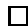

We remark that, at the cost of complicating the above proofs, the formula  $\gamma$  in Lemma 7 could in fact have been replaced by the simpler formula  $\forall x_{1}\forall x_{2}\forall x_{3}(r(x_{1},x_{2})\land r(x_{2},x_{3})\to r(x_{1},x_{3}))$ , asserting the transitivity of a binary relation. Indeed, it is known that extending  $\mathcal{C}^2$  or even  $\mathcal{G}\mathcal{C}^2$  with the ability to express transitivity of relations renders the satisfiability problem for this fragment undecidable. (Tendera [15] shows this in the case of four transitive relations; see also Gradel and Otto [5] for closely related results.) Notice in this context that the formula  $\varphi^{\prime}$  constructed in the proof of Theorem 3 is not in  $\mathcal{G}\mathcal{C}^2$ , since it contains the non-guarded conjunct  $\forall xy(h(x,y)\leftrightarrow \neg \bar{h} (x,y))$ . As we shall see in the next section, this is no accident: query-answering and finite query-answering are decidable with respect to sentences of  $\mathcal{G}\mathcal{C}^2$  and positive conjunctive queries. For an investigation of the data-complexity of satisfiability and query-answering in certain logics featuring both counting quantifiers and transitive predicates—and indeed of practical methods for solving these problems—see, for example, Hustadt et al. [6], Glimm et al. [4], Ortiz et al. [9].

# 5 The fragment  $\mathcal{G}\mathcal{C}^2$

In this section, we establish some facts about  $\mathcal{GC}^2$  which will subsequently be used to analyse the complexity of query-answering and finite query-answering within this fragment. To help motivate this analysis, we begin with an overview of our approach.

Let  $\varphi$  be a sentence of  $\mathcal{GC}^2$ ,  $\Delta$  a set of ground, function-free literals, and  $\varphi(\bar{y})$  a positive conjunctive query. For simplicity, let us assume for the moment that the tuple  $\bar{y}$  is empty—that is,  $\psi$  is the Boolean query

$$
\exists x _ {1} \dots \exists x _ {n} \left(p _ {1} \left(y _ {1}, z _ {1}\right) \wedge \dots \wedge p _ {s} \left(y _ {s}, z _ {s}\right)\right), \tag {3}
$$

where the  $y_{i}$  and  $z_{i}$  are chosen from among the set of variables  $V = \{x_{1},\ldots ,x_{n}\}$ . Formula (3) defines a graph  $(G,E)$  on this set in a natural way:  $(x_{i},x_{j})\in E$  just in case  $i\neq j$  and, for some  $k$ $(1\leqslant k\leqslant s)$ ,  $\{x_i,x_j\} = \{y_k,z_k\}$ . Again, for simplicity, let us assume for the moment that the resulting graph,  $(V,E)$ , is connected.

Now, there are two possibilities: either the graph  $(V,E)$  contains a loop (that is: it is 2-connected) or it does not (that is: it is a tree). If the latter, it can be shown (Lemma 16, below) that  $\psi$  is logically equivalent to some  $\mathcal{GC}^2$ -formula  $\pi$ . But then the problem  $\mathcal{Q}_{\varphi,\psi}$  is the complement of the problem  $S_{\varphi\wedge\neg\pi}$ , which is in NP by Theorem 1. Suppose, therefore, that  $(V,E)$  contains a loop, and consider any model  $\mathfrak{A} \models \psi$ . It is obvious that  $\mathfrak{A}$  contains a sequence of elements  $a_0,\ldots,a_{t-1}$  ( $t \leqslant s$ ) such that for all  $i$  ( $1 \leqslant i < t$ ), there is a binary predicate  $p$  with either  $\mathfrak{A} \models p[a_i,a_{i+1}]$  or  $\mathfrak{A} \models p[a_{i+1},a_i]$  (where the addition in the indices is modulo  $t$ ). Let us call such a sequence a cycle. We therefore establish the following 'big-cycles' lemma for  $\mathcal{GC}^2$ -formulas  $\varphi$  (Lemma 13, below): if  $\Delta \cup \{\varphi\}$  is (finitely) satisfiable, then, for arbitrarily large  $\Omega \in \mathbb{N}$ ,  $\Delta \cup \{\varphi\}$  has a (finite) model in which no cycles with  $t \leqslant \Omega$  exist. It follows that  $\Delta \cup \{\varphi\}$  is (finitely) satisfiable if and only if  $\Delta \cup \{\varphi,\neg\psi\}$  is (finitely) satisfiable. That is, the problem  $\mathcal{Q}_{\varphi,\psi}$  is the complement of the problem  $S_{\varphi}$ , which, again, is in NP by Theorem 1; similarly, mutatis mutandis, for finite satisfiability.

For satisfiability (as opposed to finite satisfiability), this 'big-cycles' lemma is relatively straightforward, and close to the familiar fact that  $\mathcal{G}\mathcal{C}^2$  has the 'tree-model property' (see Kazakov [7], Theorem 1). For finite satisfiability, however, more work is required. We now proceed to lay the foundations for that work.

Lemma 8. Let  $\varphi$  be a formula of  $\mathcal{GC}^2$ ,  $\mathfrak{A}$  a structure interpreting the signature of  $\varphi$ , and  $I$  a nonempty set. For  $i \in I$ , let  $\mathfrak{A}_i$  be a copy of  $\mathfrak{A}$ , with the domains  $A_i$  pairwise disjoint. If  $\varphi$  is satisfied in  $\mathfrak{A}$ , then it is satisfied in the structure  $\mathfrak{A}'$  with domain  $A' = \bigcup_{i \in I} A_i$  and interpretations  $q^{\mathfrak{A}'} = \bigcup_{i \in I} q^{\mathfrak{A}_i}$  for every predicate  $q$ .

Proof. If  $\theta : \{x, y\} \to A$  is any variable assignment, and  $i \in I$ , let  $\theta_i$  be the variable assignment which maps  $x$  and  $y$  to the corresponding elements in  $A_i \subseteq A'$ . A routine structural induction on  $\varphi$  shows that  $\mathfrak{A} \models_{\theta} \varphi$  if and only if, for some  $(= \text{for all})$ $i \in I$ ,  $\mathfrak{A}' \models_{\theta_i} \varphi$ .

It follows immediately that, if a formula of  $\mathcal{GC}^2$  has a finite model, then it has arbitrarily large finite models, and indeed infinite models.

As with  $\mathcal{C}^2$ , so too with  $\mathcal{G}\mathcal{C}^2$ , we can limit the nesting of quantifiers.

Lemma 9. Let  $\varphi$  be a  $\mathcal{GC}^2$ -formula. There exist (i) a quantifier-free  $\mathcal{GC}^2$ -formula  $\alpha$  with  $x$  as its only variable, (ii) binary predicates  $e_1, \ldots, e_l$ , and  $f_1, \ldots, f_m$  (different from  $\approx$ ), (iii) quantifier-free  $\mathcal{GC}^2$ -formulas  $\beta_1, \ldots, \beta_l$ , (iv) positive integers  $C_1, \ldots, C_m$  with the following property. If  $\varphi^*$  is the  $\mathcal{GC}^2$ -formula

$$
\begin{array}{l} \forall x \alpha \wedge \bigwedge_ {1 \leqslant h \leqslant l} \forall x \forall y (e _ {h} (x, y) \rightarrow (\beta_ {h} \vee x \approx y)) \wedge \\ \bigwedge_ {1 \leqslant i \leqslant m} \forall x \exists = C _ {i} y (f _ {i} (x, y) \wedge x \not \approx y), \tag {4} \\ \end{array}
$$

and  $C = \max_h C_h$ , then (i)  $\varphi^* \models \varphi$ , and (ii) any model of  $\varphi$  over a domain having at least  $C + 1$  elements may be expanded to a model of  $\varphi^*$ .

Proof. Routine adaptation of standard techniques. See, e.g. Borger et al. [2], p. 378.  $\square$

In view of Lemma 9, we fix a signature  $\Sigma^{*}$  of unary and binary predicates and a  $\mathcal{GC}^2$ -sentence  $\varphi^{*}$  over this signature, having the form (4). For the remainder of Section 5, all structures will interpret the signature  $\Sigma^{*}$ . We refer to the predicates  $f_{1},\ldots ,f_{m}$  in (4) as the counting predicates of  $\Sigma^{*}$ ; and we understand the notions of message type, invertible message type, silent 2-type and vacuous 2-type as in Definition 3.

For the next definition, if  $\pi$  is a 1-type we denote by  $\pi[y/x]$  the set of formulas obtained by replacing all occurrences of  $x$  in  $\pi$  by  $y$ . (Recall that 1-types, on our definition, always involve the variable  $x$ : so, technically,  $\pi[y/x]$  is not a 1-type.)

Definition 14. Let  $\pi$  and  $\pi'$  be 1-types over  $\Sigma^*$ . Denote by  $\pi \times \pi'$  the vacuous 2-type

$$
\pi \cup \pi^ {\prime} [ y / x ] \cup \left\{\neg q (x, y), \neg q (y, x) \mid q \text {a b i n a r y p r e d i c a t e o f} \Sigma^ {*} \right\}.
$$

Lemma 10. Suppose  $\mathfrak{A} \models \varphi^*$ , and let  $\mathfrak{A}$  be the structure obtained by replacing every silent 2-type in  $\mathfrak{A}$  by the corresponding vacuous 2-type, that is:

$$
\mathrm {t p} ^ {\mathfrak {A}} [ a, b ] = \left\{ \begin{array}{l} \mathrm {t p} ^ {\mathfrak {A}} [ a ] \times \mathrm {t p} ^ {\mathfrak {A}} [ b ] i f \mathrm {t p} ^ {\mathfrak {A}} [ a, b ] i s s i l e n t \\ \mathrm {t p} ^ {\mathfrak {A}} [ a, b ] o t h e r w i s e. \end{array} \right.
$$

Then  $\hat{\mathfrak{A}}\models \varphi^{*}$

Proof. Since the 1-types of elements are the same in  $\mathfrak{A}$  and  $\hat{\mathfrak{A}}$ ,  $\hat{\mathfrak{A}} \models \forall x\alpha$ . Since the only 2-types realized in  $\hat{\mathfrak{A}}$  but not in  $\mathfrak{A}$  are vacuous, and since the guards in  $e_h$  are not satisfied by pairs of elements having vacuous 2-types,  $\hat{\mathfrak{A}} \models \bigwedge_{1 \leqslant h \leqslant l} \forall x \forall y (e_h(x, y) \to (\beta_h \lor x \approx y))$ . Since all elements send the same messages in  $\mathfrak{A}$  and  $\hat{\mathfrak{A}}$ ,  $\hat{\mathfrak{A}} \models \bigwedge_{1 \leqslant i \leqslant m} \forall x \exists = C_i y (f_i(x, y) \land x \not\approx y)$ .

Lemma 11. Suppose that  $\mathfrak{A} \models \varphi^*$ , and that  $B$  and  $B'$  are disjoint subsets of  $A$  such that  $|B| \geqslant (mC)^2 + mC + 1$ , and  $|B'| \geqslant mC + 1$ . Then there exist elements  $b \in B$  and  $b' \in B'$  such that  $\mathrm{tp}^{\mathfrak{A}}[b, b']$  is silent.

Proof. Pick any  $B_0^{\prime}\subseteq B^{\prime}$  such that  $|B_0^{\prime}| = mC + 1$ . Now set

$$
B _ {0} = \{b \in B \mid \text {f o r s o m e} b ^ {\prime} \in B _ {0} ^ {\prime}, b ^ {\prime} \text {s e n d s a m e m a s s a g e t o} b \}.
$$

Since  $\mathfrak{A} \models \varphi^{*}$ , no element of  $B_0'$  sends a message to more than  $mC$  other elements, and since  $|B_0'| = mC + 1$ ,  $|B_0| \leqslant mC(mC + 1)$ . But  $|B| > mC(mC + 1)$ ; so let  $b \in B \setminus B_0$ . Again,  $b$  can send a message to at most  $mC$  elements of  $B_0'$ , yet  $|B_0'| > mC$ ; so let  $b'$  be an element of  $B_0'$  to which  $b$  does not send a message.

The ensuing analysis hinges on the special notion of a 't-cycle', which we now proceed to define. In the sequel, we employ the notions of path and cycle in a graph  $G$  in the usual way, where paths and cycles are not permitted to encounter nodes more than once (except of course that cycles loop back to their starting points). We take the length of a path  $v_{0},\ldots ,v_{l}$  to be  $l$ , and the length of a cycle  $v_{0},\ldots ,v_{l}$  (where  $v_{l} = v_{0}$ ) to be  $l$ . We insist that, by definition, all cycles have length at least 3.

Definition 15. Let  $\mathfrak{A}$  be any structure interpreting  $\Sigma^{*}$  over a domain  $A$ ; let  $O \subseteq A$ ; and let

$$
E = \{(a, b) \in A ^ {2} \mid a \neq b \text {a n d e i t h e r} \mathrm {t p} ^ {\mathfrak {A}} [ a, b ] \text {i s n o t v a c u o u s}
$$

$$
\left. \text {o r} a \text {a n d} b \text {a r e b o t h i n} O \right\},
$$

so that  $G = (A, E)$  is a graph. By a  $t$ -cycle in  $(\mathfrak{A}, O)$ , we mean a cycle in  $G$  containing at least one node lying outside  $O$ . A  $t$ -cycle in  $(\mathfrak{A}, O)$  is strong if, for any consecutive pair of elements  $a$  and  $b$  in that cycle, either  $a$  and  $b$  are both in  $O$  or  $\mathrm{tp}^{\mathfrak{A}}[a, b]$  is an invertible message-type.

To motivate these notions, think of  $O$  as the set of 'observable elements' of  $A$ —the elements that will interpret the constants in some set of ground, function-free literals  $\Delta$ . By contrast, the elements of  $A \setminus O$  are the 'theoretical' elements—elements whose existence may be perhaps forced by the background theory  $\varphi^*$ . A t-cycle is thus a cycle in the graph  $G$  of Definition 15 which involves at least one theoretical element.

Our first task is to show that, given any (finite) model  $\mathfrak{A}$  of  $\varphi^{*}$  and any  $O \subseteq A$ , we can remove all 'short' strong t-cycles in  $(\mathfrak{A}, O)$ .

Lemma 12. Suppose  $\mathfrak{A}_0 \models \varphi^*$ ; and let  $O \subseteq A_0$  and  $\Omega > 0$ . We can find a model  $\mathfrak{B} \models \varphi^*$  such that: (i)  $O \subseteq B$ ; (ii)  $\mathfrak{A}_0|_O = \mathfrak{B}|_O$ ; and (iii) there are no strong  $t$ -cycles in  $(\mathfrak{B}, O)$  of length less than  $\Omega$ . Moreover, if  $\mathfrak{A}_0$  is finite, then we can ensure that  $\mathfrak{B}$  is finite.

Proof. Assume without loss of generality that  $\Omega \geqslant 4$ , let

$$
K = 2 (| O | + 1) ((m C) ^ {\Omega} - 1) / (m C - 1) + 2,
$$

and let  $\mathfrak{A}_1, \ldots, \mathfrak{A}_K$  be isomorphic copies of  $\mathfrak{A}_0$ , with  $A_i \cap A_j = \emptyset$  for all  $i, j$  ( $0 \leqslant i < j \leqslant K$ ). Let  $\mathfrak{A}$  (with domain  $A$ ) be the union of  $\mathfrak{A}_0$  together with all of these copies. Formally:

$$
\begin{array}{l} A = \bigcup_ {0 \leqslant i \leqslant K} A _ {i} \\ q ^ {\mathfrak {A}} = \bigcup_ {0 \leqslant i \leqslant K} q ^ {\mathfrak {A} _ {i}} \text {f o r a n y p r e d i c a t e} q. \\ \end{array}
$$

By Lemma 8,  $\mathfrak{A} \models \varphi^{*}$ . (Here, we require that  $\varphi^{*}$  is in  $\mathcal{C}^2$ , not just in  $\mathcal{C}^2$ .) Moreover, if any element of  $A$  sends a message of type  $\mu$  in  $\mathfrak{A}$ , then at least  $K$  elements of  $A \setminus O$  do so.

For  $a, b \in A$ , let us say that  $b$  is directly accessible from  $a$  if either (i)  $a = b$ , (ii)  $\mathrm{tp}^{\mathfrak{A}}[a, b]$  is a message-type (not necessarily invertible), or (iii)  $a$  and  $b$  are both in  $O$ ; further, let us say that  $b$  is accessible from  $a$  in  $l$  steps, if there exists a sequence of elements  $a_0, \ldots, a_l$  of  $A$  such that  $a_0 = a$ ,  $a_l = b$  and, for all  $i$  ( $0 \leqslant i < l$ ),  $a_{i+1}$  is directly accessible from  $a_i$ . If  $a \in A$ , the number of elements accessible from  $a$  in  $l$  steps is certainly bounded by  $(|O| + 1)\sum_{0 \leqslant i \leqslant l}(mC)^i$ .

Suppose then

$$
\gamma = a _ {0}, a _ {1}, a _ {2} \dots , a _ {0}
$$

is a strong t-cycle in  $(\mathfrak{A}, O)$  of minimal length  $l < \Omega$ ; and assume, without loss of generality, that  $a_0 \notin O$ . We modify  $\mathfrak{A}$  (without affecting  $\mathfrak{A}|_O$ ) so as to destroy this t-cycle, taking care only to create new strong t-cycles of greater length. Let  $a = a_0$  and  $b = a_1$ , and let  $\mu$  be the invertible message-type such that  $\mathrm{tp}^{\mathfrak{A}}[a, b] = \mu$ .

Claim. There exist pairwise distinct elements  $c, d, e, f \in A \setminus O$  such that

1.  $\mathrm{tp}^{\mathfrak{A}}[c,d] = \mu$  
2. neither  $c$  nor  $d$  is accessible from either  $a$  or  $b$  in  $\Omega - 2$  steps;  
3.  $\mathrm{tp}^{\mathfrak{A}}[e] = \mathrm{tp}^{\mathfrak{A}}[a]$ , and  $\mathrm{tp}^{\mathfrak{A}}[f] = \mathrm{tp}^{\mathfrak{A}}[b]$ ;  
4.  $\mathrm{tp}^{\mathfrak{A}}[e,f]$  is silent;  
5.  $\mathrm{tp}^{\mathfrak{A}}[d,e]$  is not a message-type.

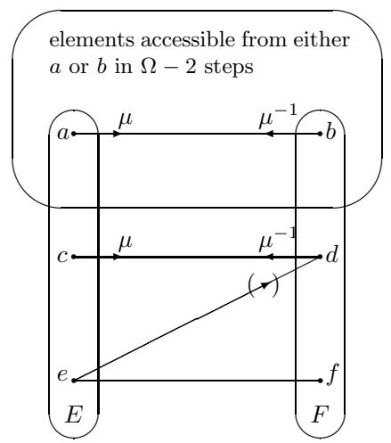  
Figure 1: The configuration of the claim in the proof of Lemma 12. An arrow on a line indicates a message-type; absence of an arrow on a line indicates a non-message type; a parenthetical arrow on a line indicates a 2-type which may or may not be a message-type. For definiteness,  $e$  and  $f$  have been drawn outside the set of elements accessible from  $a$  or  $b$  in  $\Omega - 2$  steps; however, this is not required by the claim.

Proof of Claim. Refer to Fig. 1. The number of elements of  $A \setminus O$  accessible from either  $a$  or  $b$  in  $\Omega - 1$  steps is bounded by

$$
2 (| O | + 1) \left(\sum_ {i = 0} ^ {\Omega - 1} (m C) ^ {i}\right) = 2 (| O | + 1) ((m C) ^ {\Omega} - 1) / ((m C) - 1) <   K.
$$

So choose  $c \in A \setminus O$  such that  $c$  sends a message of type  $\mu$ , and  $c$  is not accessible from either  $a$  or  $b$  in  $\Omega - 1$  steps; and choose  $d \in A$  such that  $\mathrm{tp}^{\mathfrak{A}}[c, d] = \mu$ . It follows that  $d$  is not accessible from  $a$  or  $b$  in  $\Omega - 2$  steps. Let  $E$  be the set of elements of  $A \setminus O$  having the same 1-type as  $a$ , and  $F$  the set of elements of  $A \setminus O$  having the same 1-type as  $b$ . Now,  $E$  and  $F$  have cardinality at least  $K$ , where, since  $\Omega \geqslant 4$ ,

$$
K \geqslant 2 ((m C) ^ {4} - 1) / (m C - 1) + 2 = 2 ((m C) ^ {3} + (m C) ^ {2} + m C + 2),
$$

Hence  $|E \setminus \{a, b, c, d\}| \geqslant 2mC((mC)^2 + mC + 1)$ ; and similarly,  $|F \setminus \{a, b, c, d\}| \geqslant 2mC((mC)^2 + mC + 1)$ . Therefore, we may select subsets  $E_1, \ldots, E_{mC}$  of  $E \setminus \{a, b, c, d\}$  and subsets  $F_1', \ldots, F_{mC}'$  of  $F \setminus \{a, b, c, d\}$ , each containing at least  $(mC)^2 + mC + 1$  elements, and with these  $2mC$  sets pairwise disjoint. Applying Lemma 11 to  $E_i$  and  $F_i$  for all  $i$  ( $1 \leqslant i \leqslant cM$ ), select  $e_i \in E_i$  and  $f_i \in F_i$  such that  $\mathrm{tp}^{\mathfrak{A}}[e_i, f_i]$  is silent. But  $d$  cannot send a message to more than  $mC - 1$  of the  $e_i$  (since it already sends a message to  $c$ ), so we may pick  $e$  to be some  $e_i$  such that  $\mathrm{tp}^{\mathfrak{A}}[d, e_i]$  is not a message-type, and  $f$  to be the corresponding  $f_i$ . The elements  $c, d, e$  and  $f$  then have all the properties required by the claim.

Having obtained  $c, d, e, f$ , and returning to the proof of the lemma, we modify  $\mathfrak{A}$  so as to ensure that the 2-type connecting  $a$  and  $d$  is silent. (Note that  $\mathrm{tp}^{\mathfrak{A}}[a, d]$  is certainly not a message-type, but  $\mathrm{tp}^{\mathfrak{A}}[d, a]$  might be.) More precisely, we

  
a

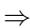

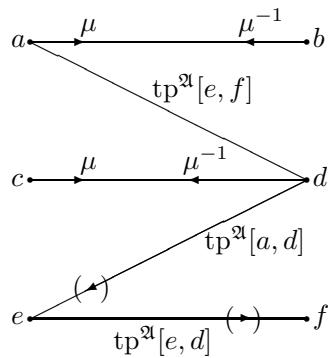  
Figure 2: Ensuring that  $\mathrm{tp}^{\mathfrak{A}'}[a,d]$  is silent. Types displayed in the drawing of  $\mathfrak{A}'$  are to be read left-to-right: thus,  $\mathrm{tp}^{\mathfrak{A}'}[a,d] = \mathrm{tp}^{\mathfrak{A}}[e,f]$ ,  $\mathrm{tp}^{\mathfrak{A}'}[e,d] = \mathrm{tp}^{\mathfrak{A}}[a,d]$ , and  $\mathrm{tp}^{\mathfrak{A}'}[e,f] = \mathrm{tp}^{\mathfrak{A}}[e,d]$ . Lines and arrows are interpreted as in Fig. 1.  
$\mathfrak{A}^{\prime}$

define the structure  $\mathfrak{A}'$  over  $A$  to be exactly like  $\mathfrak{A}$  except that

$$
\operatorname {t p} ^ {\mathfrak {A} ^ {\prime}} [ a, d ] = \operatorname {t p} ^ {\mathfrak {A}} [ e, f ]
$$

$$
\operatorname {t p} ^ {\mathfrak {A} ^ {\prime}} [ e, d ] = \operatorname {t p} ^ {\mathfrak {A}} [ a, d ]
$$

$$
\operatorname {t p} ^ {\mathfrak {A} ^ {\prime}} [ e, f ] = \operatorname {t p} ^ {\mathfrak {A}} [ e, d ].
$$

The transformation of  $\mathfrak{A}$  into  $\mathfrak{A}'$  is depicted in Fig. 2. The elements  $a$ ,  $c$  and  $e$  all have the same 1-type in  $\mathfrak{A}$ ; similarly for  $b$ ,  $d$  and  $f$ . Therefore, these type-assignments are legitimate, and do not affect the 1-types of any elements, whence  $\mathfrak{A}' \models \forall x\alpha$ . Since no new 2-types are introduced,  $\mathfrak{A}' \models \bigwedge_{1 \leqslant h \leqslant l} \forall x \forall y (e_h(x, y) \rightarrow (\beta_h \lor x \approx y))$ . By inspection of Fig. 2, every element sends the same messages in  $\mathfrak{A}'$  as in  $\mathfrak{A}$  (though to different elements), whence  $\mathfrak{A}' \models \bigwedge_{1 \leqslant i \leqslant m} \forall x \exists = C_i y (f_i(x, y) \land x \not\approx y)$ . Thus,  $\mathfrak{A}' \models \varphi^*$ . Since  $a, e \notin O$ ,  $\mathfrak{A}'|_O = \mathfrak{A}|_O$ ; and by construction,  $\mathrm{tp}^{\mathfrak{A}'}[a, d]$  is silent. Note also that  $\mathfrak{A}$  and  $\mathfrak{A}'$  never differ with respect to any invertible message-types: in particular, the strong t-cycles in  $(\mathfrak{A}, O)$  are exactly the strong t-cycles in  $(\mathfrak{A}', O)$ .

We are now ready to destroy the strong t-cycle  $\gamma$  in  $(\mathfrak{A}', O)$ . Let  $\mathfrak{A}''$  be exactly like  $\mathfrak{A}'$ , except that

$$
\mathrm {t p} ^ {\mathfrak {A} ^ {\prime \prime}} [ a, b ] = \mathrm {t p} ^ {\mathfrak {A} ^ {\prime}} [ a, d ]
$$

$$
\operatorname {t p} ^ {\mathfrak {A} ^ {\prime \prime}} [ a, d ] = \operatorname {t p} ^ {\mathfrak {A} ^ {\prime}} [ a, b ]
$$

$$
\mathrm {t p} ^ {\mathfrak {A} ^ {\prime \prime}} [ c, b ] = \mathrm {t p} ^ {\mathfrak {A} ^ {\prime}} [ c, d ]
$$

$$
\mathrm {t p} ^ {\mathfrak {A} ^ {\prime \prime}} [ c, d ] = \mathrm {t p} ^ {\mathfrak {A} ^ {\prime}} [ c, b ].
$$

The transformation of  $\mathfrak{A}'$  into  $\mathfrak{A}''$  is depicted in Fig. 3. Again, these assignments are legitimate, with 1-types unaffected; no new 2-types are introduced; and every element of  $A$  sends the same messages in  $\mathfrak{A}''$  as it does in  $\mathfrak{A}'$  (though to different elements). Thus  $\mathfrak{A}'' \models \varphi^*$ . Since  $a, c \notin O$ ,  $\mathfrak{A}''|_O = \mathfrak{A}'|_O = \mathfrak{A}|_O$ ; and by construction,  $\gamma$  is not a strong t-cycle in  $(\mathfrak{A}''', O)$ . Moreover, we claim that any sequence  $\gamma'$  which is a strong t-cycle in  $(\mathfrak{A}''', O)$ , but not in  $(\mathfrak{A}', O)$ , is longer than  $\gamma$ . To show this, we suppose  $|\gamma'| \leqslant |\gamma| < \Omega$ , and derive a contradiction.

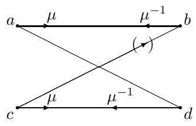  
$\mathfrak{A}^{\prime}$

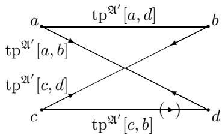  
Figure 3: Destroying a strong t-cycle: the two-types in  $\mathfrak{A}''$  are to be read from left to right; thus,  $\mathrm{tp}^{\mathfrak{A}''}[a,b] = \mathrm{tp}^{\mathfrak{A}'}[a,d]$ ,  $\mathrm{tp}^{\mathfrak{A}''}[a,d] = \mathrm{tp}^{\mathfrak{A}'}[a,b]$ ,  $\mathrm{tp}^{\mathfrak{A}''}[c,b] = \mathrm{tp}^{\mathfrak{A}'}[c,d]$  and  $\mathrm{tp}^{\mathfrak{A}''}[c,d] = \mathrm{tp}^{\mathfrak{A}'}[c,b]$ . Lines and arrows are interpreted as in Fig. 1.  
$\Rightarrow$  
$\mathfrak{A}^{\prime \prime}$

Since  $\gamma'$  is not a strong t-cycle in  $(\mathfrak{A}', O)$ , at least one of the pairs  $(a, d)$ ,  $(d, a)$ ,  $(b, c)$  or  $(c, b)$  is consecutive in  $\gamma'$ ; so suppose, without loss of generality, that  $(a, d)$  is. Indeed, by starting the cycle  $\gamma'$  at  $d$ , we may write

$$
\gamma^ {\prime} = d, \dots , a, d.
$$

Now  $b$  certainly occurs in  $\gamma'$ . For otherwise, all consecutive pairs of  $\gamma'$  except  $(a, d)$  send each other messages in  $\mathfrak{A}'$ , contradicting the fact that  $d$  is not accessible from  $a$  in  $\Omega - 2$  steps. In fact, an exactly similar argument shows that  $(c, b)$  occurs as a consecutive pair in  $\gamma'$ , since  $d$  is not accessible from  $b$  in  $\Omega - 2$  steps either. Thus, we may write:

$$
\gamma^ {\prime} = d, c _ {1}, \dots , c _ {s}, c, b, b _ {1}, \dots , b _ {t}, a, d,
$$

$(s,t\geqslant 0)$ . Returning to the structure  $\mathfrak{A}'$ , then, we see that

$$
\begin{array}{l} \gamma_ {1} = d, c _ {1}, \dots , c _ {s}, c, d \\ \gamma_ {2} = b, b _ {1}, \dots , b _ {t}, a, b \\ \end{array}
$$

are strong t-cycles in  $(\mathfrak{A}', O)$ ; and so, by the minimality of  $\gamma$  in  $\mathfrak{A}'$ , we have  $s + 2 \geqslant |\gamma|$  and  $t + 2 \geqslant |\gamma|$ . It follows that  $|\gamma'| = s + t + 4 \geqslant 2|\gamma| > |\gamma|$ , a contradiction.

Thus, in transforming  $\mathfrak{A}$  into  $\mathfrak{A}''$ , we destroy one strong t-cycle of length less than  $\Omega$ , and create only longer strong t-cycles. Proceeding in this way, then, we eventually destroy all strong t-cycles of length less than  $\Omega$ .

Our next task is to show that, given any (finite) model  $\mathfrak{A}$  of  $\varphi^{*}$  and any  $O\subseteq A$ , we can remove all 'short' t-cycles in  $(\mathfrak{A},O)$ , strong or otherwise.

Lemma 13. Suppose  $\mathfrak{A}_0 \models \varphi^*$ ; and let  $O \subseteq A_0$  and  $\Omega > 0$ . We can find a model  $\mathfrak{B} \models \varphi^*$  such that: (i)  $O \subseteq B$ ; (ii)  $\mathfrak{A}_0|_O = \mathfrak{B}|_O$ ; and (iii) there are no  $t$ -cycles in  $(\mathfrak{B}, O)$  of length less than  $\Omega$ . Moreover, if  $\mathfrak{A}_0$  is finite, then we can ensure that  $\mathfrak{B}$  is finite.

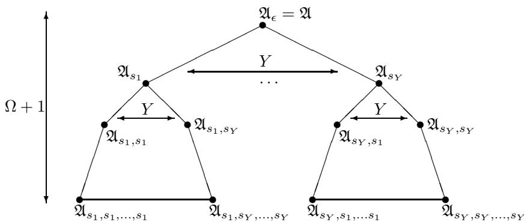  
Figure 4: Organization of  $\mathfrak{A}^*$  as a tree of copies of  $\mathfrak{A}_0$ , in the case where  $Y = |S|$  is finite; for legibility, the elements of  $S$  are numbered, arbitrarily, as  $s_1, \ldots, s_Y$ .

Proof. By Lemma 12, let  $\mathfrak{A}$  be a finite or countable model of  $\varphi^{*}$ , with  $\mathfrak{A}$  finite if  $\mathfrak{A}_0$  is, such that: (i)  $O \subseteq A$ ; (ii)  $\mathfrak{A}_0|_O = \mathfrak{A}|_O$ ; and (iii) there are no strong t-cycles in  $(\mathfrak{A}, O)$  of length less than  $\Omega$ . Let

$$
S = \{\langle a, b \rangle \in A ^ {2} \mid a \neq b \text {a n d} \operatorname {t p} ^ {\mathfrak {A}} [ a, b ] \text {i s a n o n - i n v e r t i b l e m e a s g e - t y p e} \},
$$

and let  $Y = |S|$ . Obviously, if  $\mathfrak{A}$  is finite, then so is  $Y$ . In addition, let  $S^{*\Omega}$  be the set of sequences of elements of  $S$  of length  $\leqslant \Omega$ . We denote the length of  $\sigma \in S^{*\Omega}$  by  $|\sigma|$ ; we write empty sequence as  $\epsilon$  and the concatenation of sequences  $\sigma$  and  $\tau$  as  $\sigma\tau$ ; as usual, we identify sequences of length 1 with the corresponding elements of  $S$ .

Let  $\mathfrak{A}_{\epsilon} = \mathfrak{A}$ . For  $\sigma \in S^{*\Omega} \setminus \{\epsilon\}$ , let  $\mathfrak{A}_{\sigma}$  be a new copy of  $\mathfrak{A}$ , with domain  $A_{\sigma}$ ; and for any  $a \in A$ , denote by  $a_{\sigma}$  the corresponding element of  $A_{\sigma}$ . We assume that the  $A_{\sigma}$  ( $\sigma \in S^{*\Omega}$ ) are pairwise disjoint. Now let  $\mathfrak{A}^*$  be given by:

$$
A ^ {*} = \bigcup_ {\sigma \in S ^ {* \Omega}} A _ {\sigma}
$$

$$
q ^ {\mathfrak {A} ^ {*}} = \bigcup_ {\sigma \in S ^ {* \Omega}} q ^ {\mathfrak {A} _ {\sigma}} \text {f o r a n y p r e d i c a t e} q.
$$

Note that  $O \subseteq A \subseteq A^{*}$ . We may picture  $\mathfrak{A}^*$  as a tree of copies of  $\mathfrak{A}$ , with  $\mathfrak{A}_{\epsilon} = \mathfrak{A}$  at the root, and having branching factor  $Y$ . We notionally divide the tree into tiers, taking the root to be the first tier, and the leaves to be the  $(\Omega + 1)$ th tier. The case where  $Y$  is finite is illustrated in Fig. 4; the case where  $Y = \aleph_0$  may be pictured analogously. By Lemma 8,  $\mathfrak{A}^* \models \varphi^*$ . (Here, we require that  $\varphi^*$  is in  $\mathcal{GC}^2$ , not just in  $\mathcal{C}^2$ .) Moreover, there are no strong t-cycles in  $(\mathfrak{A}^*, O)$  of length less than  $\Omega$ .

We modify  $\mathfrak{A}^*$  as follows to obtain a structure  $\mathfrak{B}$  over the domain  $B = A^{*}$ . As a first (easy) step, if  $a$  and  $b$  are any distinct elements of  $A^{*}$ , not both in  $O$ , such that  $\mathrm{tp}^{\mathfrak{A}}[a,b]$  is silent but not vacuous, we can apply Lemma 10, and replace  $\mathrm{tp}^{\mathfrak{A}}[a,b]$  with the vacuous 2-type  $\mathrm{tp}^{\mathfrak{A}}[a] \times \mathrm{tp}^{\mathfrak{A}}[b]$ . (Notice that this transformation does not affect  $\mathfrak{A}^{*}|_{O}$ .) Hence, we may assume that, if  $(a,b)$  is a consecutive pair in some t-cycle in  $(\mathfrak{A}^{*}, O)$ , with  $a,b$  not both in  $O$ , then at

least one of  $\mathrm{tp}^{\mathfrak{A}}[a,b]$  and  $\mathrm{tp}^{\mathfrak{A}}[b,a]$  is a message-type. Furthermore, since there are no strong t-cycles in  $(\mathfrak{A}^{*},O)$  of length less than  $\Omega$ , any t-cycle in  $(\mathfrak{A}^{*},O)$  of length less than  $\Omega$  contains at least one consecutive pair  $(a,b)$ , such that: (i)  $a$  and  $b$  are not both in  $O$ , and (ii) exactly one of  $\mathrm{tp}^{\mathfrak{A}}[a,b]$  and  $\mathrm{tp}^{\mathfrak{A}}[b,a]$  is a message-type (and hence a non-invertible message-type).

We obtain  $\mathfrak{B}$  from  $\mathfrak{A}^*$  by re-directing non-invertible messages in successive tiers of the tree in Fig. 4 as follows. First, we consider the structure  $\mathfrak{A}_{\epsilon} = \mathfrak{A}$  at the root of the tree. Let  $a, b$  be any distinct elements of  $A$ , not both in  $O$ . If  $\mathrm{tp}^{\mathfrak{A}}[a, b]$  is a non-invertible message-type  $\mu$ , then we divert the message which  $a$  sends to  $b$  in  $\mathfrak{A}^*$  so that it instead points to the element corresponding to  $b$  in the structure at the  $\langle a, b \rangle$ th position in the second tier of the tree in Fig. 4. Formally, we set

$$
\operatorname {t p} ^ {\mathfrak {B}} [ a, b ] = \operatorname {t p} ^ {\mathfrak {A} ^ {*}} [ a ] \times \operatorname {t p} ^ {\mathfrak {A} ^ {*}} [ b ]
$$

$$
\operatorname {t p} ^ {\mathfrak {B}} [ a, b _ {\langle a, b \rangle} ] = \operatorname {t p} ^ {\mathfrak {A} ^ {*}} [ a, b ].
$$

Otherwise, we leave the elements of  $\mathfrak{A}_{\epsilon}$  unaffected. This transformation is depicted in Fig. 5.

Next, we consider the copies of  $\mathfrak{A}$  in tiers 2 to  $\Omega$ : i.e. those  $\mathfrak{A}_{\sigma}$  such that  $1 \leqslant |\sigma| < \Omega$ . Let  $a, b$  be any distinct elements of  $A$ . If  $\mathrm{tp}^{\mathfrak{A}}[a, b]$  is a non-invertible message-type  $\mu$ , then we divert the message which  $a_{\sigma}$  sends to  $b_{\sigma}$  in  $\mathfrak{A}^{*}$  so that it instead points to the element corresponding to  $b$  in the copy of  $\mathfrak{A}$  located at the  $\langle a, b \rangle$ th daughter of  $\mathfrak{A}_{\sigma}$ . Formally, we set

$$
\operatorname {t p} ^ {\mathfrak {B}} \left[ a _ {\sigma}, b _ {\sigma} \right] = \operatorname {t p} ^ {\mathfrak {A} ^ {*}} \left[ a _ {\sigma} \right] \times \operatorname {t p} ^ {\mathfrak {A} ^ {*}} \left[ b _ {\sigma} \right]
$$

$$
\operatorname {t p} ^ {\mathfrak {B}} \left[ a _ {\sigma}, b _ {\sigma \langle a, b \rangle} \right] = \operatorname {t p} ^ {\mathfrak {A} ^ {*}} \left[ a _ {\sigma}, b _ {\sigma} \right].
$$

Otherwise, we leave the elements of  $\mathfrak{A}_{\sigma}$  unaffected.

Finally, we consider the copies of  $\mathfrak{A}$  in the bottom tier: i.e. those  $\mathfrak{A}_{\sigma}$  such that  $|\sigma| = \Omega$ . Let  $a, b$  be any distinct elements of  $A$ . If  $\mathrm{tp}^{\mathfrak{A}}[a, b]$  is a non-invertible message-type  $\mu$ , then we divert the message which  $a_{\sigma}$  sends to  $b_{\sigma}$  in  $\mathfrak{A}^{*}$  so that it instead loops back to the element corresponding to  $b$  in the structure located at the  $\langle a, b \rangle$ th node of the second tier of the tree. Formally, we set

$$
\operatorname {t p} ^ {\mathfrak {B}} \left[ a _ {\sigma}, b _ {\sigma} \right] = \operatorname {t p} ^ {\mathfrak {A} ^ {*}} \left[ a _ {\sigma} \right] \times \operatorname {t p} ^ {\mathfrak {A} ^ {*}} \left[ b _ {\sigma} \right]
$$

$$
\operatorname {t p} ^ {\mathfrak {B}} \left[ a _ {\sigma}, b _ {\langle a, b \rangle} \right] = \operatorname {t p} ^ {\mathfrak {A} ^ {*}} \left[ a _ {\sigma}, b _ {\sigma} \right].
$$

Otherwise, we leave the elements of  $\mathfrak{A}_{\sigma}$  unaffected.

It is obvious that these assignments are legitimate, leave 1-types unaffected, introduce no new 2-types, and leave the number of messages of each type sent by any element unaffected. Hence,  $\mathfrak{B} \models \varphi^{*}$ . It is equally obvious that  $\mathfrak{B}|_{O} = \mathfrak{A}^{*}|_{O} = \mathfrak{A}_{0}|_{O}$ , and that there are no t-cycles in  $(\mathfrak{B}, O)$  of length less than  $\Omega$ .

We remark that the method of removing short t-cycles used in Lemma 13 works only for cycles featuring non-invertible message types. In particular, the large 'fan-in' at elements of structures in the second tier requires that the message-types being redirected are non-invertible.

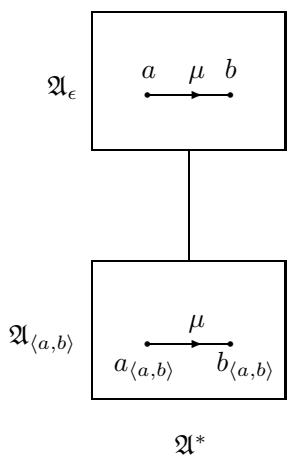  
Figure 5: Re-direction of non-invertible messages in  $\mathfrak{A}_{\epsilon}$  in the proof of Lemma 13.

# 6 Data-complexity of query-answering and finite query-answering

In this section, we prove that the query-answering and finite query-answering problems with respect to a positive conjunctive query  $\psi(\bar{y})$  and a formula  $\varphi$  of  $\mathcal{GC}^2$  are in the class co-NP. Lemma 13 plays a key role in this proof, by allowing us to re-write positive conjunctive queries as disjunctions of queries involving only two variables (at which point we can apply Theorem 1). The remainder of the proof is largely a matter of book-keeping.

We begin with a generalization of the observation that  $\forall x\forall y\theta (x,y)$  is logically equivalent to  $\forall x\theta (x,x)\land \forall x\forall y(x\not\approx y\to \theta (x,y))$  . We employ the following notation. Fix some set of constants  $K$  and tuple of variables  $\bar{x} = x_{1},\ldots ,x_{n}$  Let  $\Xi$  be the set of all functions  $\xi :\bar{x}\rightarrow \bar{x}\cup K$  . For each  $\xi \in \Xi$  , denote by  $\bar{x}_{\xi}$  the (possibly empty) tuple of variables  $\xi (x_1),\dots ,\xi (x_n)$  with all constants and duplicates removed. Further, for any formula  $\theta$  , denote by  $\theta_{\xi}$  the result of simultaneously substituting the terms  $\xi (x_{1}),\ldots ,\xi (x_{n})$  for all free occurrences of the respective variables  $x_{1},\ldots ,x_{n}$  in  $\theta$

Lemma 14. Let  $\bar{x}$  be a tuple of variables,  $K$  a finite set of constants, and  $\Xi$  the set of all functions  $\xi : \bar{x} \to \bar{x} \cup K$ . If  $\theta$  is any formula, then  $\forall \bar{x}\theta$  is logically equivalent to

$$
\bigwedge_ {\xi \in \Xi} \forall \bar {x} _ {\xi} \left( \right.\left( \right.\bigwedge_ {\substack {x \in \bar {x} _ {\xi}\\c \in K}} x \not \approx c \wedge \bigwedge_ {\substack {x, x ^ {\prime} \in \bar {x} _ {\xi}\\x \neq x ^ {\prime}}} x \not \approx x ^ {\prime}\right) \rightarrow \theta_ {\xi}\right). \tag{5}
$$

In fact, let  $\Xi_1$  and  $\Xi_2$  be disjoint (possibly empty) subsets of  $\Xi$  such that  $\Xi_1 \cup \Xi_2 = \Xi$ . Then  $\forall \bar{x}\theta$  is logically equivalent to

$$
\left\{ \right.\bigwedge_ {\xi \in \Xi_ {1}} \forall \bar {x} _ {\xi} \left( \right.\left( \right.\bigwedge_ {\substack {x \in \bar {x} _ {\xi}\\c \in K}} x \not \approx c \wedge \bigwedge_ {\substack {x, x ^ {\prime} \in \bar {x} _ {\xi}\\x \neq x ^ {\prime}}} x \not \approx x ^ {\prime} \rightarrow \theta_ {\xi}\right)\right) \right\} \wedge \left\{\bigwedge_ {\xi \in \Xi_ {2}} \forall \bar {x} _ {\xi} \theta_ {\xi} \right\}. \tag{6}
$$

Proof. Denote by  $\varphi_{1}$  the formula (5), and by  $\varphi_{2}$  the formula (6). It is obvious that  $\models \forall \bar{x}\theta \rightarrow \varphi_{2},\models \varphi_{2}\rightarrow \varphi_{1}$ , and  $\models \varphi_1\rightarrow \forall \bar{x}\theta$

The next lemma allows us to remove individual constants from universally quantified formulas at the expense of adding some ground literals.

Lemma 15. Let  $\varphi$  be a formula,  $\Theta$  a set of formulas, and  $c$  an individual constant. Let  $p$  be a new unary predicate and  $z$  a new variable ('new' means 'not occurring in  $\varphi$  or  $\Theta$ ). Denote by  $\varphi'$  the result of replacing all occurrences of  $c$  in  $\varphi$  by  $z$ , and let  $\psi$  be the formula  $\forall z (\varphi' \lor \neg p(z))$ . Then the sets of formulas  $\Theta \cup \{\varphi\}$  and  $\Theta \cup \{p_c(c), \psi\}$  are satisfiable over the same domains.

Proof. Obviously,  $\{p_c(c),\psi \} \models \varphi$ . On the other hand, if  $\mathfrak{A}\models \Theta \cup \{\varphi \}$ , expand  $\mathfrak{A}$  to a structure  $\mathfrak{A}'$  by setting  $p^{\mathfrak{A}'} = \{c^{\mathfrak{A}}\}$ .

Recall that a clause is a disjunction of literals (with the empty clause,  $\bot$ , allowed), and that a clause is negative if all its literals are negative. In the sequel, we continue to confine attention to signatures involving only unary and binary predicates together with individual constants.

Definition 16. Let  $\eta$  be a clause, let  $T$  be the set of terms (variables or constants) occurring in  $\eta$ , and let

$E = \{(t_{1},t_{2})\in T^{2}\mid t_{1}\neq t_{2}$  and either  $t_1,t_2$  both occur in some literal of  $\eta$  or  $t_1$  and  $t_2$  are both constants}

Denote the graph  $(T,E)$  by  $G_{\eta}$ . (We allow the empty graph for the case  $\eta = \bot$ .) We say  $\eta$  is  $v$ -cyclic if  $G_{\eta}$  contains a cycle (in the usual graph-theoretic sense) at least one of whose nodes is a variable; otherwise, we say  $\eta$  is  $v$ -acyclic.

Definition 17. Let  $K$  be a set of individual constants. A  $v$ -formula (with respect to  $K$ ) is a sentence of the form

$$
\forall \bar {x} \left( \right.\left( \right.\bigwedge_ {\substack {x \in \bar {x}\\c \in K}} x \not \approx c \wedge \bigwedge_ {\substack {x, x ^ {\prime} \in \bar {x}\\x \neq x ^ {\prime}}} x \not \approx x ^ {\prime}\right) \rightarrow \eta\right), \tag{7}
$$

where  $\eta$  is a v-cyclic negative clause.

The intuition behind v-formulas is that they provide a counterpart to the notion of a t-cycle in a pair  $(\mathfrak{A}, O)$ , given in Definition 15. Specifically:

Remark 3. Let  $\mathfrak{A}$  be a structure,  $K$  the set of individual constants interpreted by  $\mathfrak{A}$ , and  $O = \{c^{\mathfrak{A}} \mid c \in K\}$ . Suppose that distinct individual constants in  $K$  have distinct interpretations in  $\mathfrak{A}$ . Let  $v$  be a  $v$ -formula with respect to  $K$ . If  $\mathfrak{A} \nVdash v$ , then there is a  $t$ -cycle in  $(\mathfrak{A}, O)$  of length at most  $\|v\|$ .

Definition 18. Let  $\eta$  be a clause. We call  $\eta$  splittable if, by re-ordering its literals, it can be written as  $\eta_1 \lor \eta_2$ , where  $\operatorname{Vars}(\eta_1) \cap \operatorname{Vars}(\eta_2) = \emptyset$ ; otherwise,  $\eta$  is unsplittable.

Remark 4. Let  $\eta$  be a non-ground clause. If  $\eta$  is unsplittable and  $v$ -acyclic, then it contains at most one individual constant.

Lemma 16. Let  $\eta(x, \bar{x})$  be a negative clause with no individual constants, involving exactly the variables  $x, \bar{x}$ . Suppose further that  $\eta(x, \bar{x})$  is non-empty, unsplittable and  $v$ -acyclic. Then there exists a  $\mathcal{GC}^2$ -formula of  $\psi(x)$  such that  $\forall \bar{x} \eta(x, \bar{x})$  and  $\psi(x)$  are logically equivalent.

Proof. We proceed by induction on the number of variables involved. If  $\bar{x}$  is the empty tuple, there is nothing to prove, so suppose otherwise. Since  $\eta$  is unsplittable and v-acyclic, and contains the variable  $x$ ,  $G_{\eta}$  may be viewed as a tree with  $x$  at the root. Let  $x_{1},\ldots ,x_{n}$  be the immediate descendants of  $x$  in the tree  $G_{\eta}$ . Further, for all  $i$  ( $1\leqslant i\leqslant n$ ), let  $\bar{x}_i$  be a (possibly empty) tuple consisting of those variables in  $\bar{x}$  which are proper descendants of  $x_{i}$  in  $G_{\eta}$ . Then  $\forall \bar{x}\eta (x,\bar{x})$  is logically equivalent to some formula

$$
\delta (x) \vee \bigvee_ {1 \leqslant i \leqslant n} \forall x _ {i} (\epsilon_ {i} (x, x _ {i}) \vee \forall \bar {x} _ {i} \eta_ {i} (x _ {i}, \bar {x} _ {i})),
$$

where  $\delta(x)$  is a negative clause involving exactly the variables  $\{x\}$ , and, for all  $i$  ( $1 \leqslant i \leqslant n$ ): (i)  $\epsilon_i(x, x_i)$  is a non-empty negative clause each of whose literals involves the variables  $\{x, x_i\}$ , and (ii)  $\eta_i(x_i, \bar{x}_i)$  is a negative clause which involves exactly the variables  $\{x_i\} \cup \bar{x}_i$ . By inductive hypothesis, there exists a  $\mathcal{GC}^2$ -formula  $\psi_i(x_i)$  logically equivalent to  $\forall \bar{x}_i \eta_i(x_i, \bar{x}_i)$ . But then  $\forall \bar{x} \eta(x, \bar{x})$  is logically equivalent to

$$
\delta (x) \vee \bigvee_ {1 \leqslant i \leqslant n} \forall y (\epsilon_ {i} (x, y) \vee \psi_ {i} (y)),
$$

which in turn is trivially logically equivalent to a  $\mathcal{G}\mathcal{C}^2$ -formula.

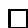

Lemma 17. Let  $\varphi$  be a  $\mathcal{GC}^2$ -formula,  $\Delta$  a finite set of ground, function-free literals, and  $\Upsilon$  a finite set of  $v$ -formulas. Suppose that  $\Delta$  contains the literal  $c \not\cong d$  for all distinct individual constants  $c$ ,  $d$  occurring in  $\Delta \cup \Upsilon$ . Then  $\Delta \cup \{\varphi\} \cup \Upsilon$  is (finitely) satisfiable if and only if  $\Delta \cup \{\varphi\}$  is (finitely) satisfiable.

Proof. The only-if direction is trivial. So suppose  $\mathfrak{A}_0^+$  is a (finite) model of  $\{\varphi\} \cup \Delta$ , with domain  $A_0$ . Let  $O \subseteq A_0$  be the set of elements interpreting the individual constants in  $\Delta \cup \Upsilon$ , and let  $\mathfrak{A}_0$  be the reduct of  $\mathfrak{A}_0^+$  obtained by ignoring the interpretations of those individual constants.

Let  $\varphi^{*}$  and  $C$  be obtained from  $\varphi$  as in Lemma 9. Let  $\mathfrak{A}_1, \ldots, \mathfrak{A}_C$  be isomorphic copies of  $\mathfrak{A}_0$  with the domains  $A_i$  ( $0 \leqslant i \leqslant C$ ) pairwise disjoint; and let  $\mathfrak{A}$  be the union of these models as in Lemma 8. Thus,  $O \subseteq A_0 \subseteq A$ ,  $\mathfrak{A} \models \varphi$ , and  $|A| > C$ . By Lemma 9, let  $\mathfrak{A}'$  be an expansion of  $\mathfrak{A}$  such that  $\mathfrak{A}' \models \varphi^{*}$ . Obviously,  $\mathfrak{A}'$  is finite if  $\mathfrak{A}_0^+$  is.

Let  $\Omega >\| v\|$  for all  $v\in \Upsilon$ . Applying Lemma 13 to  $\mathfrak{A}'$ , let  $\mathfrak{B}$  be a model of  $\varphi^{*}$  (and hence of  $\varphi$ ), finite if  $\mathfrak{A}'$  is finite, such that: (i)  $O\subseteq B$ ; (ii)  $\mathfrak{B}|_O = \mathfrak{A}'|_O = \mathfrak{A}_0|_O$ ; and (iii) there are no t-cycles in  $(\mathfrak{B},O)$  of length less than  $\Omega$ . Let

$\mathfrak{B}^+$  be the expansion of  $\mathfrak{B}$  obtained by interpreting any constants as in  $\mathfrak{A}_0^+$ . Thus,  $\mathfrak{B}^+ \models \Delta \cup \{\varphi\}$ . If  $\mathfrak{B}^+$  fails to satisfy some formula in  $\Upsilon$  of the form (7), then, by Remark 3, there is a t-cycle in  $(\mathfrak{B}, O)$  of length less than  $\Omega$ , which is impossible. Hence  $\mathfrak{B}^+ \models \Upsilon$ , as required.

Theorem 4. For any  $\mathcal{GC}^2$ -sentence  $\varphi$  and any positive conjunctive query  $\psi(\bar{y})$ , both  $\mathcal{Q}_{\varphi, \psi(\bar{y})}$  and  $\mathcal{FQ}_{\varphi, \psi(\bar{y})}$  are in co-NP.

Proof. We give the proof for  $\mathcal{F}\mathcal{Q}_{\varphi ,\psi (\bar{y})}$ ; the proof for  $\mathcal{Q}_{\varphi ,g(\bar{q})}$  is analogous.

Let an instance  $\langle \Delta, \bar{a} \rangle$  of  $\mathcal{F}\mathcal{Q}_{\varphi, \psi(\bar{y})}$  be given, where  $\bar{\Delta}$  is a set of ground, function-free literals, and  $\bar{a}$  a tuple of individual constants. By re-naming individual constants if necessary, we may assume that the constants  $\bar{a}$  all have codes of fixed length, so that  $\bar{a}$  may be regarded as a constant. Let  $n = \| \Delta \|$ , then. The instance  $\langle \Delta, \bar{a} \rangle$  is positive if and only if  $\psi(\bar{a})$  is true in every finite model of  $\Delta \cup \{\varphi\}$ . Hence, it suffices to give a non-deterministic procedure for determining the finite satisfiability of the formula

$$
\bigwedge \Delta \wedge \varphi \wedge \neg \psi (\bar {a}), \tag {8}
$$

running in time bounded by a polynomial function of  $n$ .

We may assume without loss of generality that all predicates in  $\Delta$  occur in  $\varphi$  or  $\psi(\bar{y})$ , since—provided  $\Delta$  contains no direct contradictions—literals involving foreign predicates can simply be removed. Further, we may assume that, for every ground atom  $\alpha$  over the relevant signature,  $\Delta$  contains either  $\alpha$  or  $\neg \alpha$ . For if not, non-deterministically add either of these literals to  $\Delta$ ; since all predicates of  $\varphi$  and  $\psi(\bar{y})$  are by hypothesis of arity 1 or 2, this process may be carried out in time bounded by a quadratic function of  $n$ . Finally, we may assume that, for all distinct  $c, d \in \mathrm{const}(\Delta) \cup \bar{a}$ ,  $\Delta$  contains the literal  $c \not\approx d$ , since, if  $\Delta$  contains  $c \approx d$ , either of these constants can be eliminated.

Since  $\psi(\bar{y})$  is a positive conjunctive query, we may take  $\neg \psi(\bar{a})$  to be  $\forall \bar{x} \eta$ , where  $\eta$  is a negative clause. Let  $K = \mathrm{const}(\Delta) \cup \bar{a}$ , and let  $\Xi$  be the set of functions from  $\bar{x}$  to  $\bar{x} \cup K$ . Thus,  $|\Xi| \leqslant (n + l_1 + l_2)^{l_1}$ , where  $l_1$  is the arity of  $\bar{x}$  and  $l_2$  is the arity of  $\bar{y}$ . Employing the notation of Lemma 14, and recalling Definition 16, let

$$
\begin{array}{l} \Xi_ {1} = \{\xi \in \Xi \mid \eta_ {\xi} \text {i s v - c y c l i c} \} \\ \Xi_ {2} = \{\xi \in \Xi \mid \eta_ {\xi} \text {i s v - a c y c l i c} \}. \\ \end{array}
$$

Thus, Formula (8) is logically equivalent to

$$
\bigwedge \Delta \wedge \varphi \wedge \bigwedge_ {\xi \in \Xi_ {1}} \forall \bar {x} _ {\xi} \left( \right.\left( \right.\bigwedge_ {\substack {x \in \bar {x} _ {\xi}\\c \in K}} x \not \approx c \wedge \bigwedge_ {\substack {x, x ^ {\prime} \in \bar {x} _ {\xi}\\x \neq x ^ {\prime}}} x \not \approx x ^ {\prime}\right) \rightarrow \eta_ {\xi}\right) \wedge \bigwedge_ {\xi \in \Xi_ {2}} \forall \bar {x} _ {\xi} \eta_ {\xi}; \tag{9}
$$

moreover, this latter formula can be computed in time bounded by a polynomial function of  $|\Xi|$ , and hence of  $n$ . Let us write (9) as

$$
\bigwedge \Delta \wedge \varphi \wedge \bigwedge \Upsilon \wedge \bigwedge_ {\xi \in \Xi_ {2}} \forall \bar {x} _ {\xi} \eta_ {\xi}; \tag {10}
$$

where  $\Upsilon$  is a finite set of v-formulas with respect to  $K$ . Let  $\eta_{\xi}^{\Delta}$  denote  $\top$  if any ground literal of  $\eta_{\xi}$  appears in  $\Delta$ ; otherwise, let  $\eta_{\xi}^{\Delta}$  be the result of deleting from  $\eta_{\xi}$  all ground literals whose negation appears in  $\Delta$ . (If no literals remain,  $\eta^{\Delta}$  is taken to be  $\bot$ .) Thus, (10) is logically equivalent to

$$
\bigwedge \Delta \wedge \varphi \wedge \bigwedge \Upsilon \wedge \bigwedge_ {\xi \in \Xi_ {2}} \forall \bar {x} _ {\xi} \eta_ {\xi} ^ {\Delta}. \tag {11}
$$

Since  $\Delta$  contains every ground literal or its negation over the relevant signature, no ground literal can appear in any of the  $\eta_{\xi}^{\Delta}$ . Moreover, if any of the  $\eta_{\xi}^{\Delta}$  is empty, (11) is trivially unsatisfiable; so we may suppose otherwise. List the formulas  $\forall \bar{x}_{\xi}\eta_{\xi}^{\Delta}$  for  $\xi \in \Xi_2$ , as  $\forall \bar{x}_i\eta_i$  ( $1 \leqslant i \leqslant s$ ); and re-write each  $\forall \bar{x}_i\eta_i$  as a disjunction

$$
\forall \bar {x} _ {i, 1} \eta_ {i, 1} \vee \dots \vee \forall \bar {x} _ {i, t _ {i}} \eta_ {i, t _ {i}}
$$

where the  $\eta_{i,j}$  are unsplittable. For each  $i$  ( $1 \leqslant i \leqslant s$ ), pick a value  $j$  ( $1 \leqslant j \leqslant t_i$ ) and write  $\forall \bar{x}_{i,j} \eta_{i,j}$  as  $\forall \bar{x}_i' \eta_i'$ . Thus, (11) is finitely satisfiable if and only if, for some way of making the above choices, the resulting formula

$$
\bigwedge \Delta \wedge \varphi \wedge \bigwedge \Upsilon \wedge \bigwedge_ {1 \leqslant i \leqslant s} \forall \bar {x} _ {i} ^ {\prime} \eta_ {i} ^ {\prime} \tag {12}
$$

is finitely satisfiable. This (non-deterministic) step may again be executed in time bounded by a polynomial function of  $n$ . Note that each  $\eta_i'$  is v-acyclic, unsplittable and non-ground; hence, by Remark 4, it contains at most one individual constant. We may assume for simplicity, and without loss of generality, that  $\eta_i'$  contains exactly one individual constant—say,  $c_i$ .

Let  $\eta_i^{\prime \prime}$  be the result of replacing all occurrences of  $c_{i}$  in  $\eta_i^\prime$  by  $x$  (where  $x$  does not occur in  $\eta_i^\prime$ ), and let  $p_i$  be a new unary predicate depending only on the clause  $\eta_i^{\prime \prime}$  (and not on  $i$ ): that is, if  $\eta_i^{\prime \prime} = \eta_j^{\prime \prime}$ , then  $p_i = p_j$ . Since  $\eta_i^\prime$  contains at most one individual constant,  $\eta_i^{\prime \prime}$  is a clause in the signature of  $\psi (\bar{y})$ ; therefore, the number of distinct predicates  $p_i$  is bounded by some constant, independent of  $\Delta$ . Let  $\Delta' = \{p_i(c_i)\mid 1\leqslant i\leqslant s\}$ . By Lemma 15, then, (12) is satisfiable over the same domains as

$$
\bigwedge (\Delta \cup \Delta^ {\prime}) \wedge \varphi \wedge \bigwedge \Upsilon \bigwedge_ {1 \leqslant i \leqslant s} \forall x \bar {x} _ {i} ^ {\prime} \left(\eta_ {i} ^ {\prime \prime} \vee \neg p _ {i} (x)\right). \tag {13}
$$

Evidently, (13) can be computed in time bounded by a polynomial function of  $n$ ; in particular,  $|\Delta'|$  is also bounded in this way. However, the number of formulas  $\forall x\bar{x}_i'(\eta_i'' \lor \neg p_i(x))$  occurring in (13)—assuming duplicates to be omitted—is bounded by a constant. By Lemma 16, there exists, for each such  $\forall x\bar{x}_i'(\eta_i'' \lor \neg p_i(x))$ , a logically equivalent  $\mathcal{GC}^2$ -formula  $\forall x\theta_i(x)$ . Let  $\theta$  be the conjunction of all these  $\forall x\theta_i(x)$ . Then (13) is logically equivalent to

$$
\bigwedge (\Delta \cup \Delta^ {\prime}) \wedge (\varphi \wedge \theta) \wedge \Upsilon . \tag {14}
$$

Finally, by Lemma 17, (14) is finitely satisfiable if and only if

$$
\bigwedge (\Delta \cup \Delta^ {\prime}) \wedge (\varphi \wedge \theta) \tag {15}
$$

is finitely satisfiable. Since  $(\varphi \wedge \theta)$  is a one of a finite number  $H$  of possible  $\mathcal{C}^2$ -(and hence  $\mathcal{C}^2$ -) formulas, where  $H$  depends only on the signature of  $\psi(\bar{y})$ , and not on  $\Delta$ , the finite satisfiability of (15) can be tested nondeterministically in time bounded by a polynomial function of  $n$ , by Theorem 1.

That the same complexity bounds are obtained for the query-answering and finite query-answering problems in Theorem 4 is, incidentally, not something that should be taken for granted. For example, Rosati [13] presents a relatively simple logic (not a subset of  $\mathcal{C}^2$ ) for which query-answering is always decidable, but finite query-answering in general undecidable.

Acknowledgments This paper was written during a visit to the Faculty of Computer Science at the Free University of Bozen-Bolzano. The author wishes to express his appreciation for this opportunity and to acknowledge the help of Diego Calvanese, David Toman and Alessandro Artale in discussions on this topic.

# References

[1] A. Artale, D. Calvanese, R. Kontchakov, and M. Zakharyaschev. DL-Lite in the light of first-order logic. In Proceedings of the Twenty-Second AAAI Conference on Artificial Intelligence, AAAI'07, pages 361-366. AAAI Press, 2007.  
[2] Egon Borger, Erich Grädel, and Yuri Gurevich. The Classical Decision Problem. Perspectives in Mathematical Logic. Springer-Verlag, Berlin, 1997.  
[3] D. Calvanese, G. De Giacomo, D. Lembo, M. Lenzerini, and R. Rosati. Data complexity of query answering in description logics. In *Principles of Knowledge Representation and Reasoning*, KR'06, pages 260-270. AAAI Press, 2006.  
[4] Birte Glimm, Ian Horrocks, Carsten Lutz, and Ulrike Sattler. Conjunctive query answering for the description logic SHIQ. Journal of Artificial Intelligence Research, 31:157-204, 2008.  
[5] Erich Grädel and Martin Otto. On logics with two variables. Theoretical Computer Science, 224(1-2):73-113, 1999.  
[6] Ullrich Hustadt, Boris Motik, and Ulrike Sattler. Reasoning in description logics by a reduction to disjunctive Datalog. Journal of Automated Reasoning, 39(3):351-384, 2007.  
[7] Y. Kazakov. A polynomial translation from the two-variable guarded fragment with number restrictions to the guarded fragment. In J. J. Alferes and J. Leite, editors, *Logics in Artificial Intelligence: 9th European Conference*,

JELIA 2004, volume 3229 of Lecture Notes in Artificial Intelligence, pages 372-384, Berlin, 2004. Springer.  
[8] H.W Lenstra, Jr. Integer programming with a fixed number of variables. Mathematics of Operations Research, 8:538-548, 1983.  
[9] Magdalena Ortiz, Diego Calvanese, and Thomas Eiter. Data complexity of query answering in expressive description logics via tableaux. J. of Automated Reasoning, 2008. Forthcoming.  
[10] Leszek Pacholski, Wieslaw Szwast, and Lidia Tendera. Complexity results for first-order two-variable logic with counting. SIAM Journal on Computing, 29(4):1083-1117, 1999.  
[11] Ian Pratt-Hartmann. Complexity of the two-variable fragment with counting quantifiers. Journal of Logic, Language and Information, 14:369-395, 2005.  
[12] Ian Pratt-Hartmann. Complexity of the guarded two-variable fragment with counting quantifiers. Journal of Logic and Computation, 17:133-155, 2007.  
[13] Riccardo Rosati. On the decidability and finite controllability of query processing in databases with incomplete information. In Proceedings of the Twenty-fifth ACM SIGACT SIGMOD SIGART Symposium on Principles of Database Systems, PODS 2006, pages 356-365, 2006.  
[14] Andrea Schaerf. On the complexity of the instance checking problem in concept languages with existential quantification. Journal of Intelligent Information Systems, 2(3):265-278, 1993.  
[15] L. Tendera. Counting in the two variable guarded logic with transitivity. In V. Diekert and B. Durand, Proceedings, STACS'05, volume 3404 of Lecture notes in Computer Science, pages 83-96. Springer, Berlin, 2005.